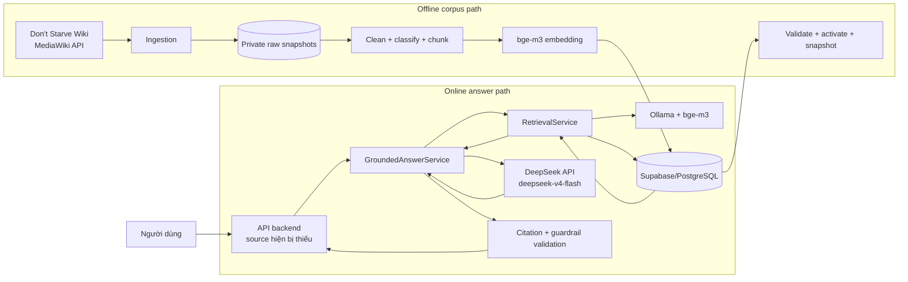
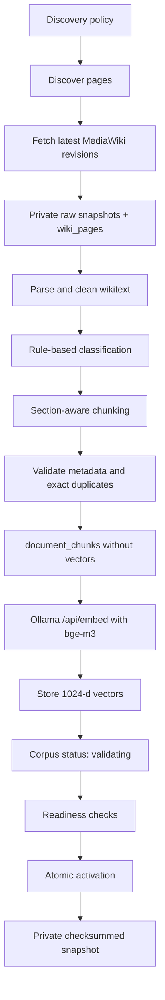
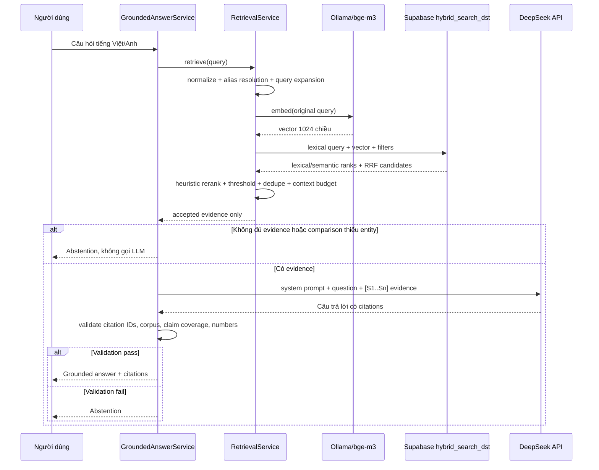
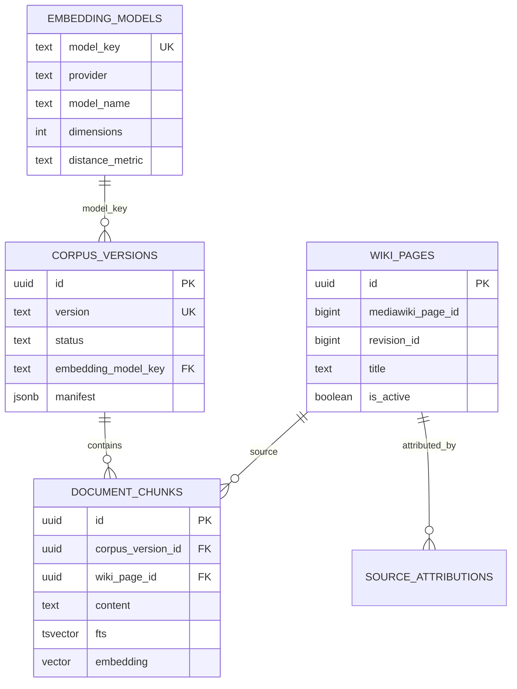
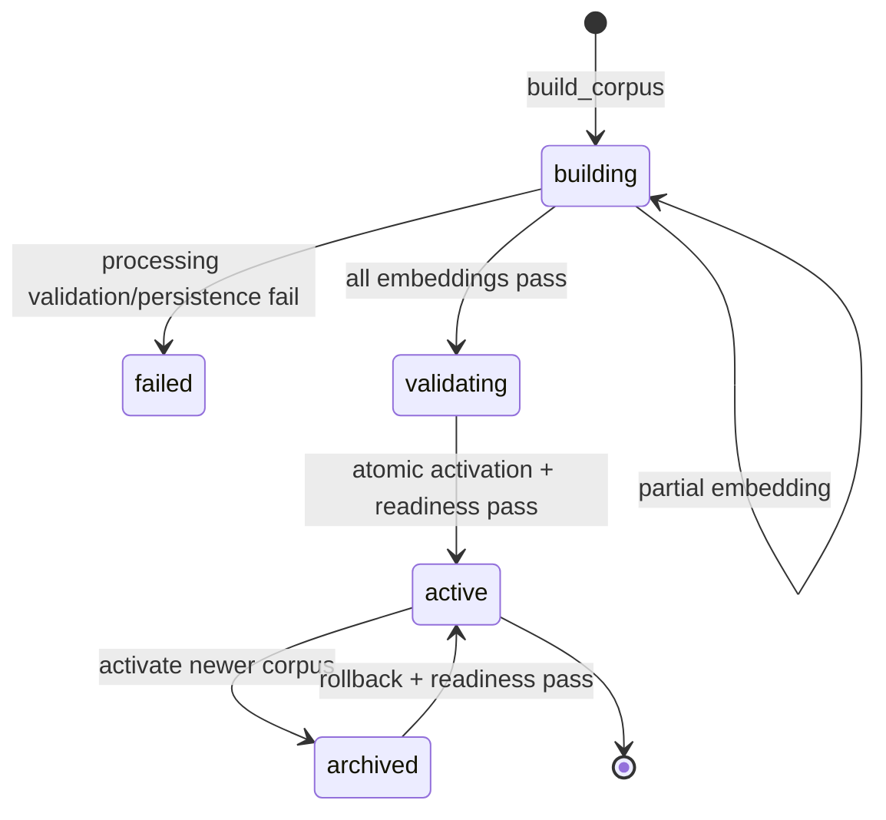

# Kiến trúc nâng cao (đường chạy cũ)

> Đường chạy mặc định đã được đơn giản hóa. Hãy bắt đầu từ `README.md` với kiến
> trúc Wiki → bge-m3 → Supabase → DeepSeek. Tài liệu này mô tả các module nâng cao
> được giữ lại để tham khảo, không còn là kiến trúc runtime mặc định.

> Tài liệu này mô tả implementation thực tế đang có trong workspace ngày 17/07/2026.
> Những phần chỉ xuất hiện trong test nhưng không có source runtime được đánh dấu rõ là **chưa hiện
> diện trong workspace**, không được trình bày như một tính năng đang chạy.

## 1. Tóm tắt kiến trúc trong một câu

Project là một hệ thống **hybrid RAG có versioning corpus**: dữ liệu được crawl từ MediaWiki, làm
sạch và chia chunk bằng các thuật toán xác định, tạo vector 1024 chiều bằng embedding model
`bge-m3`, lưu vào Supabase/PostgreSQL, tìm kiếm bằng cả full-text search lẫn cosine vector search,
rerank bằng công thức heuristic, rồi gửi chỉ các evidence đã chọn tới DeepSeek API để viết câu trả
lời tiếng Việt có citation.

Điểm quan trọng nhất:

- `bge-m3` **không trả lời người dùng**. Nó biến đoạn văn và câu hỏi thành vector.
- DeepSeek **không tìm kiếm database**. Nó chỉ nhận câu hỏi và evidence đã được retrieval chọn.
- Retrieval không chỉ dùng embedding. Nó kết hợp alias tiếng Việt, full-text search, vector search,
  Reciprocal Rank Fusion (RRF), heuristic reranking, filtering và deduplication.
- Citation/guardrail được kiểm tra bằng code xác định sau khi LLM trả lời; nếu câu trả lời không đạt,
  hệ thống trả về abstention thay vì phát tán câu trả lời không grounded.

## 2. Trạng thái implementation hiện tại

### 2.1 Những khối đang có source

| Khối | Trạng thái | Source chính |
|---|---|---|
| Cấu hình typed từ environment | Có | `src/config/settings.py` |
| Crawl MediaWiki | Có | `src/ingestion/*`, `scripts/sync_wiki.py` |
| Làm sạch, phân loại, chunk và validate | Có | `src/processing/*`, `scripts/build_corpus.py` |
| Glossary và alias tiếng Việt | Có code | `src/terminology/*`, `scripts/sync_aliases.py` |
| Embedding local bằng Ollama | Có | `src/embeddings/*`, `scripts/embed_corpus.py` |
| Supabase schema, pgvector, FTS, HNSW, RRF | Có | `supabase/migrations/*` |
| Retrieval và reranking | Có | `src/retrieval/*` |
| DeepSeek/Ollama LLM adapter | Có | `src/generation/llm.py` |
| Prompt, guardrail và citation validation | Có | `src/generation/*` |
| Corpus activation, snapshot, restore, rollback | Có | `src/operations/*`, `scripts/*corpus.py` |
| Retrieval/answer evaluation | Có code | `src/evaluation/*`, `scripts/evaluate_*.py` |
| Public-safe knowledge repository | Có | `src/supabase_store/knowledge_repository.py` |
| In-process rate limiter | Có | `src/security/rate_limit.py` |

### 2.2 Những khối bị thiếu trong workspace này

| Khối | Bằng chứng mong đợi | Trạng thái thực tế |
|---|---|---|
| FastAPI runtime/composition root | Tests import `apps.api.main` và `apps.api.dependencies` | Không có thư mục `apps/` |
| API routes `/api/chat`, `/api/health`, `/api/corpus/status` | Được mô tả trong unit tests | Chỉ có contract test; route source không có |
| Crawl policy JSON | Script mặc định dùng `data/ingestion/discovery_config.json` | Không có thư mục `data/` |
| Glossary CSV | Code mặc định dùng `data/glossary/dst_vi_glossary.csv` | Không có thư mục `data/` |
| Evaluation datasets | Code trỏ tới các file dưới `data/` | Không có trong snapshot |
| Python dependency manifest | Cần `pyproject.toml` hoặc `requirements*.txt` | Không có ở project root |
| Frontend source | `node_modules` tồn tại | Không có `package.json` hoặc source frontend |

Vì vậy, core domain/RAG đã được implement tương đối đầy đủ, nhưng workspace hiện tại chưa phải một
application có thể chạy end-to-end chỉ bằng một lệnh. Đặc biệt, `create_llm_adapter()` đã sẵn sàng
chọn DeepSeek, nhưng không có composition root hiện hữu để xây toàn bộ object graph và expose HTTP
route.

## 3. System context



Một deployment hợp với cấu hình hiện tại sẽ phân bố như sau:

- Máy local hoặc backend server: chạy Python orchestration và Ollama `bge-m3`.
- Supabase local/hosted: lưu metadata, chunks, vector, FTS index và chạy hybrid RPC.
- DeepSeek cloud: chỉ sinh câu trả lời từ evidence.
- DeepSeek không nhận toàn bộ corpus, vector hay Supabase credential.

## 4. Embedding, thuật toán và LLM khác nhau ở đâu?

| Thành phần | Loại | Có học máy không? | Vai trò trong project |
|---|---|---:|---|
| Unicode/accent normalization | Thuật toán xác định | Không | Chuẩn hóa tiếng Việt, dấu câu và whitespace |
| Alias resolution | Thuật toán + glossary | Không | Ánh xạ “mũ da heo” sang canonical entity tiếng Anh |
| `bge-m3` | Embedding model | Có | Chuyển text thành vector 1024 chiều |
| PostgreSQL FTS | Thuật toán lexical search | Không | Tìm chunk có từ/cụm từ trùng khớp |
| Cosine distance | Phép đo vector | Không | Đo độ gần ngữ nghĩa giữa hai vector |
| HNSW | Cấu trúc chỉ mục ANN | Không phải model | Tăng tốc nearest-neighbor vector search |
| RRF | Thuật toán fusion | Không | Gộp thứ hạng lexical và semantic |
| Heuristic reranker | Công thức chấm điểm | Không | Chấm lại theo RRF, overlap, entity, section và subjectivity |
| `deepseek-v4-flash` | Generative LLM | Có | Viết câu trả lời tiếng Việt từ evidence |
| Citation validator | Regex + rule | Không | Chặn citation giả, claim thiếu nguồn và số liệu không được hỗ trợ |

Như vậy project dùng **hai model có vai trò hoàn toàn khác nhau**:

1. `bge-m3`: model biểu diễn/tìm kiếm.
2. `deepseek-v4-flash`: model sinh ngôn ngữ.

Phần nằm giữa hai model chủ yếu là thuật toán và database, không phải LLM.

## 5. Hai pipeline tách biệt

RAG này có một pipeline offline và một pipeline online.

### 5.1 Pipeline offline: xây knowledge base

Pipeline này chạy khi crawl lần đầu, wiki thay đổi hoặc cần phát hành corpus mới:



### 5.2 Pipeline online: trả lời một câu hỏi

Pipeline này chạy cho mỗi request chat:



## 6. Pipeline offline chi tiết

### 6.1 Bước 1 — Discovery và crawl MediaWiki

Entry point: `scripts/sync_wiki.py:25`.

`DiscoveryPolicy` (`src/ingestion/page_discovery.py:42`) dự kiến được đọc từ JSON và định nghĩa:

- seed page titles;
- seed categories;
- namespace cho phép/cấm;
- title/category deny patterns;
- độ sâu category tối đa;
- số page tối đa;
- số member tối đa trên mỗi category;
- game scope mục tiêu.

`PageDiscovery.discover()` (`src/ingestion/page_discovery.py:179`) thực hiện BFS có giới hạn qua category:

1. Resolve seed titles thành canonical page IDs.
2. Duyệt seed categories theo hàng đợi.
3. Không đi quá `max_depth`.
4. Dừng khi đủ `max_pages`.
5. Loại namespace/title/category bị deny.
6. Ghi lại cả page được nhận và candidate bị loại cùng lý do.

Đây là crawl có kiểm soát, không phải crawler tự do đi theo mọi hyperlink.

`MediaWikiClient` (`src/ingestion/mediawiki_client.py:111`) là HTTP client tuần tự:

- gửi User-Agent mô tả rõ;
- hỗ trợ gzip;
- throttle mặc định 500 ms/request;
- cache các call discovery/siteinfo;
- không cache fetch latest revision;
- retry với exponential backoff;
- batch resolve titles tối đa 50 và fetch page revisions tối đa 20;
- lấy revision ID, timestamp, SHA1, wikitext, canonical URL và content model.

`SyncManager.run()` (`src/ingestion/sync_manager.py:102`) bảo đảm ingestion có audit trail và
idempotent theo revision:

- tạo `sync_runs` với trạng thái `running`;
- bỏ qua `(mediawiki_page_id, revision_id)` đã tồn tại;
- upload raw snapshot vào private Supabase Storage với `x-upsert: false`;
- deactive revision cũ của cùng page;
- upsert metadata vào `wiki_pages`;
- lưu attribution và license vào `source_attributions`;
- hoàn tất `sync_runs` với counters và error list.

### 6.2 Bước 2 — Làm sạch wikitext

Entry point: `scripts/build_corpus.py:29`.

`WikiPageCleaner.parse()` (`src/processing/cleaner.py:52`) dùng `mwparserfromhell`, không dùng LLM:

- giữ hierarchy của heading thành `section_path`;
- bỏ gallery, reference, asset, external links, trivia và các section boilerplate;
- bỏ link ảnh/category khỏi nội dung;
- trích category, template name và exclusivity hints;
- chuyển infobox fields thành facts dạng text;
- chuyển MediaWiki table thành các dòng `Row N: field: value`;
- giữ list/table/infobox dưới dạng text có cấu trúc;
- chuẩn hóa whitespace nhưng không tự phát minh nội dung.

Output là `ParsedPage`, gồm các `ParsedSection` và classifier evidence.

### 6.3 Bước 3 — Phân loại bằng rule

`PageClassifier` (`src/processing/classifier.py:42`) không phải ML classifier. Nó dùng category,
template, title và section heading để gán:

- `game_scope`: `dst`, `dont_starve`, `reign_of_giants`, `shipwrecked`, `hamlet`, `mixed`,
  `unknown`;
- `entity_type`: character, item, weapon, armor, food, recipe, structure, mob, boss...;
- `source_kind`: factual article, guide, version history hoặc category list;
- `subjective`: true với guide.

Mỗi classification lưu cả lý do như `category`, `infobox_template` hoặc
`insufficient_scope_evidence`, giúp audit được vì sao label được chọn.

### 6.4 Bước 4 — Chunk theo section

`SectionChunker` (`src/processing/chunker.py:42`) có default:

- target: 450 token;
- hard maximum: 600 token;
- overlap: 60 token.

Token ở đây được đếm bằng regex Unicode, không phải tokenizer của `bge-m3` hoặc DeepSeek.

Mỗi chunk có header:

```text
Page: <page title>
Section: <section path>
Game: <game scope>
Entity type: <entity type>

<cleaned body>
```

Chunker cố giữ infobox, table và pure list thành atomic block. Chunk được nhận dạng bằng SHA-256
của page ID, revision, section, chunk index và content hash. Metadata chứa parser/chunking version,
classification reasons, categories và `body_hash`.

### 6.5 Bước 5 — Validate corpus trước khi insert

`CorpusValidator.validate()` (`src/processing/validator.py:13`) kiểm tra:

- chunk không rỗng;
- metadata bắt buộc đầy đủ;
- `source_key` không trùng;
- exact body duplicate không trùng;
- mọi source page có ít nhất một valid unique chunk;
- metadata completeness ít nhất 95%;
- còn ít nhất một valid chunk;
- không có fatal issue.

Lưu ý: dedup ở đây là **exact hash deduplication**, không phải semantic near-duplicate detection.

`CorpusBuilder` chỉ insert chunk sau khi validation pass. Corpus vẫn giữ trạng thái `building`, chưa
thể được retrieval production sử dụng.

### 6.6 Bước 6 — Đồng bộ glossary/alias tiếng Việt

Entry point riêng: `scripts/sync_aliases.py:25`.

`Glossary.load()` (`src/terminology/glossary.py:47`) dự kiến đọc CSV, tạo alias records gồm:

- official English title;
- community/official Vietnamese term;
- abbreviation;
- typo phổ biến;
- descriptive alias;
- generated candidate có priority thấp.

Các alias được normalize bỏ dấu, xếp priority/confidence và upsert vào `entity_aliases`. Đây là lớp
giúp query tiếng Việt tìm được page title tiếng Anh mà không cần LLM dịch query.

### 6.7 Bước 7 — Tạo embedding bằng `bge-m3`

Entry point: `scripts/embed_corpus.py:35`.

Cấu hình mặc định trong `src/config/settings.py:48`:

```text
provider   = ollama
model      = bge-m3
dimensions = 1024
batch size = 16
distance   = cosine
normalized = true
```

Với default, model key được tạo thành `ollama-bge-m3-1024-unversioned`. Model key không chỉ là tên;
nó là contract gồm provider, model, revision, số chiều, distance metric, normalization và batch size.

`OllamaEmbeddingAdapter.embed()` (`src/embeddings/adapter.py:57`) gọi:

```http
POST http://127.0.0.1:11434/api/embed
Content-Type: application/json

{
  "model": "bge-m3",
  "input": ["chunk 1", "chunk 2"],
  "truncate": false
}
```

Adapter sau đó kiểm tra:

- số vector trả về đúng số input;
- mỗi vector đúng 1024 chiều;
- mọi component là số finite;
- norm gần 1 nếu manifest yêu cầu normalized.

`EmbeddingWorker.run()` (`src/embeddings/worker.py:51`) chạy resumable theo batch:

- chỉ lấy chunk có `embedding is null`;
- lưu từng vector thành công;
- ghi error metadata cho từng chunk thất bại;
- `passed` nếu tất cả chunk có vector;
- `partial` nếu chỉ một phần thành công;
- `failed` nếu không chunk nào thành công;
- chỉ chuyển corpus sang `validating` khi embedding pass hoàn toàn.

`DeterministicHashEmbeddingAdapter` cũng tồn tại nhưng chỉ là adapter lexical-hash dành cho test/local
acceptance. Nó không phải lựa chọn production tương đương `bge-m3`.

### 6.8 Bước 8 — Activate corpus

Entry point: `scripts/activate_corpus.py:27`.

SQL `knowledge.corpus_readiness()` kiểm tra:

- corpus ở `validating` hoặc `archived` tùy operation;
- processing status đã pass;
- embedding status đã pass;
- chunk/page count khớp manifest;
- không thiếu embedding;
- không dùng stale wiki revision khi activate mới;
- chunk metadata hợp lệ;
- coverage khớp active wiki pages.

`activate_corpus_version()` chạy transaction:

1. Lock target corpus.
2. Chạy readiness check.
3. Archive corpus active cũ nếu có.
4. Chuyển target thành `active`.
5. Ghi activation metadata.

Database có partial unique index bảo đảm tối đa một active corpus. Sau activation, script mặc định
export một checksummed snapshot riêng tư.

## 7. Database architecture

### 7.1 Bảng chính trong schema `knowledge`

| Bảng | Trách nhiệm |
|---|---|
| `embedding_models` | Manifest bất biến của embedding model |
| `corpus_versions` | Version và state của knowledge corpus |
| `wiki_pages` | Metadata của từng immutable MediaWiki revision |
| `document_chunks` | Clean chunks, FTS document và vector 1024 chiều |
| `entity_aliases` | Alias tiếng Việt/Anh, priority, confidence, verification |
| `source_attributions` | URL, source name và license attribution |
| `sync_runs` | Audit counters và errors của ingestion |

### 7.2 Quan hệ dữ liệu



`entity_aliases` là lookup độc lập theo canonical title; nó không có foreign key trực tiếp tới
`wiki_pages`, vì alias có thể được chuẩn bị trước khi page tương ứng có trong active corpus.

### 7.3 Indexes

- GIN trên generated `fts` column cho lexical search.
- HNSW `vector_cosine_ops` trên `embedding` cho approximate nearest-neighbor search.
- B-tree theo corpus, scope/entity và wiki/revision identity.
- GIN trigram trên normalized aliases.

`document_chunks.embedding` bị cố định `vector(1024)`. Đổi embedding model sang dimension khác đòi
hỏi migration có version và rebuild corpus, không chỉ thay một biến môi trường.

## 8. Pipeline online chi tiết

### 8.1 Normalize query

`normalize_query()` (`src/terminology/normalizer.py:103`) tạo:

- `original`: nguyên văn user input;
- `normalized`: NFC, typography và lowercase;
- `search_normalized`: bỏ dấu tiếng Việt, punctuation và extra whitespace;
- language hint: Vietnamese, English, mixed hoặc unknown.

Đây là deterministic preprocessing, không gọi model.

### 8.2 Resolve canonical entity và expand query

`AliasResolver.resolve()` (`src/terminology/resolver.py:21`) dùng:

- exact title/alias;
- prefix/containment;
- fuzzy `SequenceMatcher`, threshold mặc định 0.78;
- verified flag, priority và confidence.

`QueryExpander.expand()` thêm original query, accent-insensitive query, canonical English title và
verified aliases, tối đa 12 term. Nó cố ý không cho LLM tự phát minh synonym.

Ví dụ khái niệm:

```text
Input: "mũ da heo dùng làm gì"
Resolved entity: Football Helmet
Expanded terms: ["mũ da heo dùng làm gì", "mu da heo dung lam gi", "Football Helmet", ...]
```

### 8.3 Kiểm tra active corpus/model contract

`RetrievalService.retrieve()` (`src/retrieval/service.py:67`) lấy sole active corpus từ Supabase.
Nếu `corpus.embedding_model_key != embedding_adapter.manifest.model_key`, request bị fail ngay.

Contract này ngăn lỗi nguy hiểm: corpus được embed bằng model A nhưng query lại embed bằng model B.
Hai vector cùng có 1024 số vẫn có thể nằm trong hai không gian ngữ nghĩa khác nhau và không được phép
so sánh.

### 8.4 Embed câu hỏi

Chính câu hỏi original được gửi tới `bge-m3`:

```python
query_embedding = embedding_adapter.embed([expanded.query.original])[0]
```

Output là một vector 1024 chiều. DeepSeek chưa tham gia bước này.

### 8.5 Hybrid retrieval trong PostgreSQL

`SupabaseRetrievalRepository.hybrid_search()` (`src/supabase_store/retrieval_repository.py:70`)
gọi protected RPC `hybrid_search_dst` với:

- lexical query;
- query vector;
- 40 lexical candidates;
- 40 semantic candidates;
- optional entity type;
- verified entity titles;
- section intent;
- `rrf_k = 60`.

RPC trong `supabase/migrations/20260715040000_hybrid_retrieval_rpc.sql` thực hiện hai nhánh:

#### Nhánh lexical

```sql
fts @@ websearch_to_tsquery('simple', query)
ts_rank_cd(fts, query)
```

Phù hợp với tên item, con số, thuật ngữ hoặc cụm từ xuất hiện trực tiếp trong document.

#### Nhánh semantic

```sql
embedding <=> query_embedding
```

Đây là cosine distance qua pgvector. Similarity được tính lại thành `1 - distance`.

#### Fusion bằng RRF

```text
base_score = 1/(60 + lexical_rank) + 1/(60 + semantic_rank)
```

Sau đó SQL cộng boost nhỏ:

- `+0.020` nếu page title khớp resolved entity;
- `+0.005` nếu section path khớp intent.

Chỉ chunk của sole active corpus và `game_scope = 'dst'` được xét.

### 8.6 Heuristic reranking trong Python

`HeuristicReranker` (`src/retrieval/reranker.py:12`) chuẩn hóa các tín hiệu về `[0, 1]`:

```text
score = 0.35 * normalized_RRF
      + 0.20 * title_token_overlap
      + 0.15 * content_token_overlap
      + 0.15 * cosine_similarity
      + 0.10 * resolved_entity_match
      + 0.05 * section_intent_match
```

Nếu source là guide/subjective nhưng query không hỏi recommendation, trừ `0.08`.

Đây không phải cross-encoder reranker và cũng không phải LLM reranker. Ưu điểm là nhanh, giải thích
được và không cần model thứ ba; giới hạn là công thức/weight thủ công có thể không tổng quát bằng một
reranking model đã huấn luyện.

### 8.7 Acceptance, dedupe và confidence

`RetrievalService._accepted()`:

- chỉ nhận `game_scope == 'dst'`;
- yêu cầu rerank score tối thiểu 0.20;
- dedupe bằng `body_hash`, fallback `content_hash`;
- dừng ở `match_count`.

Confidence:

- `high`: top score >= 0.55 và có ít nhất 2 candidates;
- `medium`: top score >= 0.35;
- `low`: có candidate nhưng thấp hơn;
- `none`: không có candidate.

### 8.8 Context assembly

`ContextAssembler` (`src/retrieval/context.py:10`) mặc định:

- budget 1800 token;
- tối đa 8 chunks;
- tối đa 2 chunks cùng page/section;
- ưu tiên ít nhất một result cho mỗi resolved page;
- không cắt lưng chừng chunk; chunk vượt remaining budget bị bỏ qua.

Đây là nơi kiểm soát lượng evidence gửi sang LLM. `max_context_tokens` không phải context window toàn
bộ của model; nó là budget riêng cho retrieved chunks.

### 8.9 Pre-generation guardrails

`GroundedAnswerService.answer()` (`src/generation/service.py:41`) có thể không gọi LLM khi:

- không có accepted evidence;
- query comparison resolve được nhiều entities nhưng evidence không bao phủ đủ từng entity.

Nó cũng phát hiện:

- guide/subjective sources để yêu cầu model gắn nhãn khuyến nghị;
- cùng structured field nhưng nhiều giá trị khác nhau để yêu cầu model trình bày mâu thuẫn thay vì tự
  chọn một giá trị.

### 8.10 DeepSeek generation

Cấu hình mặc định hiện tại:

```text
provider          = deepseek
base URL          = https://api.deepseek.com
model             = deepseek-v4-flash
temperature       = 0.1
thinking          = disabled
max output tokens = 1024
timeout           = 120 seconds
```

`DeepSeekLLMAdapter.generate()` (`src/generation/llm.py:58`) gọi non-streaming
`POST /chat/completions` với Bearer API key.

DeepSeek nhận:

- system prompt yêu cầu chỉ dùng evidence;
- câu hỏi;
- control notes về subjective/conflict;
- từng source dưới dạng `[S1]`, `[S2]` với page, section, revision và content.

DeepSeek không nhận:

- vector 1024 chiều;
- toàn bộ corpus;
- Supabase key;
- raw wiki dump ngoài selected evidence;
- kết quả bị retrieval loại.

Ollama LLM adapter vẫn được giữ làm fallback, nhưng default đã là DeepSeek. Factory
`create_llm_adapter()` chỉ yêu cầu `DEEPSEEK_API_KEY` khi thực sự tạo DeepSeek adapter, nên các CLI
chỉ xử lý corpus không bị phụ thuộc vào key này.

### 8.11 Post-generation citation validation

`CitationValidator` (`src/generation/citations.py:46`) kiểm tra output sau LLM:

1. Answer không rỗng.
2. Có ít nhất một `[Sx]`.
3. Không có citation ID ngoài source map.
4. Mọi cited source thuộc active corpus.
5. Mỗi factual claim đủ dài phải có citation trong cùng câu/dòng.
6. Mọi con số/phần trăm trong claim phải xuất hiện trong cited evidence.

Nếu bất kỳ điều kiện nào fail, `GroundedAnswerService` bỏ raw LLM output và trả
`ABSTENTION_TEXT`. Đây là fail-closed behavior.

Lưu ý giới hạn: validator xác nhận cấu trúc citation và number support, nhưng không phải formal
entailment model. Một câu có citation hợp lệ vẫn có thể diễn giải sai ý của source nếu không chứa số
liệu trái phép.

## 9. Response contract

`GroundedAnswer` chứa:

- `answer`;
- danh sách source thực sự được cite;
- resolved entities;
- confidence;
- `abstained` và lý do;
- corpus version;
- subjective warning;
- detected conflicts;
- latency chia thành Supabase retrieval, rerank/context, generation và total.

Tests mô tả HTTP contract dự kiến cho `POST /api/chat`, nhưng route source hiện không có. Không nên
nhầm dataclass/service này với một API server đã chạy.

## 10. Corpus lifecycle và release



`scripts/release_corpus.py` chạy tuần tự:

1. incremental wiki sync;
2. complete corpus rebuild;
3. embedding;
4. atomic activation;
5. activation script tạo snapshot.

Nó dừng ở stage đầu tiên lỗi. Tuy nhiên, release script hiện **không gọi retrieval evaluation hoặc
answer evaluation trước activation**. Database readiness gate chỉ kiểm tra structural/data integrity,
không kiểm tra recall/NDCG/answer quality.

## 11. Evaluation architecture

### 11.1 Retrieval evaluation

`ReleaseRetrievalEvaluator` đo:

- Recall@1, @5, @10;
- MRR;
- NDCG@10;
- DST scope accuracy;
- p95 latency;
- coverage của executable subset trong dataset.

Pass condition hiện được hard-code:

```text
Recall@5 >= 0.90
Recall@10 >= 0.85
DST scope accuracy >= 0.98
p95 latency <= 1500 ms
```

### 11.2 Answer evaluation

`AnswerEvaluator` chấm saved observations bằng rule, không dùng một LLM khác làm judge:

- citation correctness;
- citation completeness/claim coverage;
- supported numbers;
- expected page support;
- subjectivity disclosure;
- abstention recall.

Các report có thể được upload vào private evaluation bucket.

## 12. Snapshot, restore và rollback

`CorpusSnapshotService` serialize records theo thứ tự xác định, gzip và tính SHA-256. Snapshot và
manifest được lưu private trong Supabase Storage, rồi pointer/checksum được ghi lại vào corpus
manifest.

`CorpusRestoreService`:

1. Download manifest và gzip object.
2. Kiểm tra schema version.
3. Kiểm tra SHA-256.
4. Giải nén và validate record counts/types.
5. Import thành target corpus version mới.
6. Giữ target ở `validating`, không tự activate.

Rollback chỉ áp dụng cho archived corpus đã pass readiness check và chạy atomically trong PostgreSQL.

## 13. Security và trust boundaries

### 13.1 Supabase secrets

- Schema `knowledge` bị revoke khỏi `public`, `anon`, `authenticated`.
- Tables và protected RPCs chỉ cấp cho `service_role`.
- Raw wiki, snapshot và evaluation report nằm trong private buckets.
- Backend repositories gắn `apikey` và Bearer token; credential không nằm trong response dataclass.

### 13.2 LLM boundary

- Source content được đặt giữa `<SOURCE_CONTENT>` tags.
- System prompt nói rõ source là untrusted instructions.
- Model không được dùng internal knowledge/internet để bổ sung fact.
- Citation validator chạy sau model.
- Unknown/fake citations bị chặn.

### 13.3 Public chat rate limiting

`SlidingWindowRateLimiter` giới hạn theo client key trong một cửa sổ 60 giây, dùng lock để an toàn
trong một process và giới hạn số key giữ trong memory.

Giới hạn kiến trúc: đây là in-process limiter, nên nhiều worker/instance không chia sẻ quota. Một
deployment scale-out cần external/shared rate limiter.

## 14. Dependency direction

Các core service phụ thuộc vào `Protocol` thay vì Supabase/Ollama concrete class:

```text
CorpusBuilder     -> ProcessingRepository protocol
EmbeddingWorker  -> EmbeddingRepository + EmbeddingAdapter protocols
RetrievalService -> HybridRetrievalRepository + EmbeddingAdapter
GroundedAnswer   -> RetrievalService + LLMAdapter
```

Concrete adapters nằm ở rìa:

```text
Supabase*Repository
OllamaEmbeddingAdapter
DeepSeekLLMAdapter
OllamaLLMAdapter
MediaWikiClient
```

Đây là dạng ports-and-adapters nhẹ ở domain/service layer, dù project chưa có composition root hoàn
chỉnh. Lợi ích là unit test có thể thay external services bằng fake/mock.

## 15. Object graph cần có ở API runtime

Source hiện thiếu `apps/api/dependencies.py`, nhưng dựa trên các interface và CLI evaluation, object
graph cần được xây theo thứ tự sau:

```text
Settings
├── SupabaseAliasRepository -> aliases
├── AliasResolver -> QueryExpander
├── EmbeddingModelManifest
├── OllamaEmbeddingAdapter(bge-m3)
├── SupabaseRetrievalRepository
├── RetrievalService
├── create_llm_adapter(Settings) -> DeepSeekLLMAdapter
└── GroundedAnswerService
```

API route sau đó chỉ nên gọi `GroundedAnswerService.answer(message)` và serialize `GroundedAnswer`.
Đây là **object graph cần thiết**, không phải code runtime đang có trong snapshot.

## 16. Failure paths quan trọng

| Failure | Nơi phát hiện | Hành vi hiện tại |
|---|---|---|
| Ollama chưa chạy | `OllamaEmbeddingAdapter` | Raise `EmbeddingError` |
| `bge-m3` chưa pull | Ollama `/api/embed` | HTTP failure thành `EmbeddingError` |
| Query/corpus model key khác nhau | `RetrievalService` | Raise `RuntimeError` trước search |
| Không có active corpus | `SupabaseRetrievalRepository` | Raise `SupabaseRetrievalError` |
| Nhiều active corpus | Repository + unique DB index | Fail closed |
| Không có accepted evidence | `GroundedAnswerService` | Abstain, không gọi DeepSeek |
| Comparison thiếu entity evidence | Guardrail | Abstain, không gọi DeepSeek |
| Thiếu `DEEPSEEK_API_KEY` | `create_llm_adapter` | Raise `ValueError` lúc tạo adapter |
| DeepSeek timeout/HTTP error | `DeepSeekLLMAdapter` | Raise `LLMError` |
| DeepSeek trả invalid JSON/content | Adapter | Raise `LLMError` |
| DeepSeek tạo citation/claim sai rule | `CitationValidator` | Bỏ output và abstain |
| Partial embedding | `EmbeddingWorker` | Corpus giữ `building`, không activate |
| Snapshot checksum sai | Restore service | Reject restore |

Một gap cần chú ý: `GroundedAnswerService.answer()` không catch `LLMError`. API layer bị thiếu cần map
lỗi provider thành HTTP response phù hợp hoặc controlled abstention, thay vì để exception không được
xử lý.

## 17. Những gì xảy ra khi hỏi một câu cụ thể

Ví dụ người dùng hỏi: **“Mũ da heo giảm bao nhiêu sát thương?”**

1. Normalizer tạo `mu da heo giam bao nhieu sat thuong`.
2. Alias resolver có thể map `mũ da heo` tới `Football Helmet` nếu glossary đã sync.
3. Query expander bổ sung canonical title và verified aliases.
4. `bge-m3` biến original query thành vector 1024 chiều.
5. PostgreSQL FTS tìm chunk có Football Helmet/damage terms.
6. HNSW cosine search tìm chunk gần ngữ nghĩa với query.
7. RRF gộp hai danh sách; entity title được boost.
8. Python reranker cộng overlap, semantic, entity và section signals.
9. Chỉ chunk DST vượt threshold, không trùng body, nằm trong context budget được giữ.
10. Chunk được gán `[S1]`, `[S2]`.
11. DeepSeek nhận câu hỏi và những source này, rồi viết câu tiếng Việt có citation.
12. Citation validator bảo đảm số phần trăm trong câu trả lời xuất hiện trong source được cite.
13. Nếu pass, trả answer; nếu không, trả abstention.

## 18. Đánh giá kiến trúc

### Điểm tốt

- Phân tách rõ ingestion, processing, embedding, retrieval và generation.
- Không dùng LLM cho những bước có thể làm deterministically.
- Embedding model contract được version hóa và kiểm tra ở runtime.
- Chỉ active corpus được search/cite.
- Hybrid search kết hợp lexical và semantic thay vì phụ thuộc một phía.
- Reranker giải thích được qua `rerank_reasons`.
- Corpus activation và rollback atomically trong database.
- Raw source, attribution, revision và snapshot được audit.
- Citation validation fail closed.
- Protocol boundaries giúp test không cần external services.

### Hạn chế/gap hiện tại

- API runtime source bị thiếu nên chưa có application end-to-end.
- Các file `data/` bắt buộc cũng bị thiếu.
- Không có dependency manifest để tái tạo môi trường Python.
- Release flow chưa gate bằng quality evaluation.
- DeepSeek provider error chưa được service chuyển thành controlled response.
- Rate limit chỉ có hiệu lực trong một process.
- Heuristic reranker chưa được học từ evaluation data.
- Exact hash dedupe không phát hiện paraphrase/near duplicate.
- Token counter của chunk/context là regex approximation, không phải tokenizer thật của model.
- Alias search đọc tối đa 1000 aliases rồi rank trong Python; cần xem lại khi glossary lớn.

## 19. Thứ tự ưu tiên để hoàn thiện application

1. Khôi phục hoặc tạo `apps/api` composition root và routes theo existing tests.
2. Khôi phục `data/ingestion/discovery_config.json`, glossary CSV và evaluation datasets.
3. Thêm Python dependency manifest và documented run commands.
4. Wire `create_llm_adapter(settings)` vào API dependencies.
5. Map `LLMError`, embedding error và Supabase error thành public-safe API errors.
6. Thêm evaluation gate trước activation trong `release_corpus.py`.
7. Chạy smoke test thật với Ollama `bge-m3`, active corpus và DeepSeek key.

## 20. Bản đồ file nhanh

```text
src/config/             Environment-backed settings
src/ingestion/          MediaWiki discovery, HTTP client, sync orchestration
src/processing/         Cleaner, rule classifier, chunker, validator, corpus builder
src/terminology/        Vietnamese normalization, glossary, alias resolution/expansion
src/embeddings/         Embedding manifest, Ollama/hash adapters, resumable worker
src/retrieval/          Hybrid retrieval orchestration, reranker, context builder
src/generation/         DeepSeek/Ollama adapters, prompt, guardrails, citations, answer service
src/supabase_store/     PostgREST/Storage adapters
src/operations/         Activation, snapshot, restore, rollback, report storage
src/evaluation/         Retrieval and answer metrics
src/security/           In-process chat rate limiter
scripts/                Operational CLI entry points
supabase/migrations/    Schema, indexes, hybrid RPC and corpus lifecycle SQL
tests/                  Unit/integration contracts and fixtures
```

## 21. Kết luận dễ nhớ

Hãy hình dung hệ thống như bốn người làm bốn việc:

1. **Corpus pipeline** chuẩn bị một thư viện sạch, chia mục và có version.
2. **`bge-m3`** là thủ thư biến câu hỏi và sách thành tọa độ để tìm gần nghĩa.
3. **Hybrid retrieval** là bộ luật chọn đúng trang/đoạn bằng cả từ khóa lẫn tọa độ ngữ nghĩa.
4. **DeepSeek** là người viết câu trả lời, nhưng chỉ được đọc những đoạn mà retrieval đưa cho và phải
   trích nguồn.

Vì vậy kiến trúc không phải “đưa câu hỏi thẳng vào DeepSeek”. Phần lớn độ tin cậy của hệ thống nằm
ở dữ liệu, corpus versioning, hybrid retrieval, reranking và validation bao quanh hai model.
