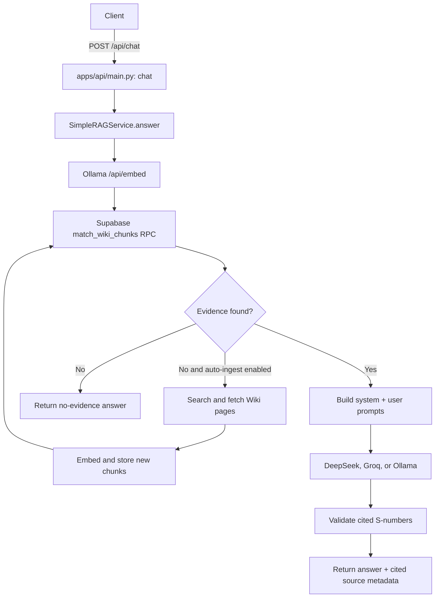

# Codebase Guide: Active API, RAG, and LLM Configuration

This guide explains the code that is actually used when the current application receives a
`POST /api/chat` request. It focuses on where to start reading, how the LLM API call is built,
and which files to edit for common changes.

Verified against the workspace on 2026-07-18.

## 1. The most important distinction

The repository contains two similar RAG/generation implementations:

| Implementation | Current status | Main files |
|---|---|---|
| Small MVP path | **Active path used by `/api/chat`** | `apps/api/main.py`, `src/rag.py`, `src/generation/llm.py` |
| Advanced corpus path | Retained for reference, evaluation, and tests; **not wired into the current API** | `src/retrieval/*`, `src/generation/service.py`, `src/generation/prompts.py`, `src/generation/citations.py` |

For the running API, remember this short path:

```text
apps/api/main.py
    -> src/rag.py
        -> src/embeddings/adapter.py
        -> Supabase REST API
        -> src/generation/llm.py
```

Do not begin with `ARCHITECTURE.md` when trying to modify the current API. That document describes
the older advanced design and contains stale statements about files that now exist. `README.md` and
this guide describe the current MVP runtime.

## 2. Recommended reading order

Read only these files first, in this order:

1. [`apps/api/main.py`](apps/api/main.py) — HTTP routes and construction of the RAG service.
2. [`src/config/settings.py`](src/config/settings.py) — every `.env` setting and default value.
3. [`src/rag.py`](src/rag.py) — active retrieval, prompt construction, LLM invocation, and citation filtering.
4. [`src/generation/llm.py`](src/generation/llm.py) — the real DeepSeek, Groq, and Ollama HTTP requests.
5. [`src/embeddings/adapter.py`](src/embeddings/adapter.py) — the separate embedding API call.
6. [`src/auto_ingest.py`](src/auto_ingest.py) — optional Wiki ingestion when retrieval finds nothing.

After understanding those six files, read `src/wiki.py`, `scripts/ingest_mvp.py`, and the MVP tests
only when you need to change ingestion or validate a modification.

## 3. Complete request flow



The LLM is not called immediately. The question must first produce at least one accepted Supabase
chunk. If retrieval still has no evidence after optional auto-ingestion, the service returns a fixed
no-evidence message without spending an LLM request.

### 3.1 API route and dependency construction

[`apps/api/main.py`](apps/api/main.py) is the composition root:

- `POST /api/chat` accepts `{"message": "..."}`.
- `ChatRequest.message` must contain 1 to 1000 characters.
- FastAPI obtains the service through `get_rag_service()`.
- `_build_rag_service()` creates the embedding adapter, Supabase vector store, optional Wiki
  auto-ingestor, and LLM adapter.
- The route calls `SimpleRAGService.answer(request.message)`.
- Provider, embedding, Supabase, and Wiki errors are returned as HTTP 502.
- Missing required configuration is returned as HTTP 503 while building the service.

Both `get_settings()` and `_build_rag_service()` use `@lru_cache`. They are created once per Python
process. Restart the API after changing `.env`; otherwise the process may continue using the old
settings and already-created adapters.

The health endpoint is only a configuration check. `/api/health` verifies that required values are
present, but it does not send a request to DeepSeek, Groq, Ollama, or Supabase.

### 3.2 Embedding the question

`SimpleRAGService.answer()` calls:

```python
query_embedding = self.embedding.embed([question])[0]
```

With the default configuration, `OllamaEmbeddingAdapter` sends:

```text
POST http://127.0.0.1:11434/api/embed
```

with a payload shaped like:

```json
{
  "model": "bge-m3",
  "input": ["the user's question"],
  "truncate": false
}
```

The embedding model is not the answering LLM. It converts the question into a 1024-dimensional
vector used for similarity search.

### 3.3 Searching Supabase

`SupabaseVectorStore.search()` in `src/rag.py` sends:

```text
POST <SUPABASE_URL>/rest/v1/rpc/match_wiki_chunks
```

with the query vector, `match_count`, and `min_similarity`. The SQL implementation is in
[`supabase/migrations/20260717000000_mvp_wiki_chunks.sql`](supabase/migrations/20260717000000_mvp_wiki_chunks.sql).

The active MVP searches the public `wiki_chunks` table using cosine similarity. It does **not** use
the advanced `hybrid_search_dst` pipeline, alias expansion, full-text search, RRF, or the heuristic
reranker.

### 3.4 Optional auto-ingestion

If Supabase returns no chunks and `AUTO_INGEST_ENABLED=true`, `WikiAutoIngestor`:

1. searches the Don't Starve Wiki for related page titles;
2. fetches up to `AUTO_INGEST_MAX_PAGES` pages;
3. cleans and chunks each page;
4. embeds the chunks using the configured embedding adapter;
5. writes them to Supabase;
6. lets `SimpleRAGService` retry the same vector search.

Set `AUTO_INGEST_ENABLED=false` if chat requests must never mutate the corpus automatically.

### 3.5 Prompt construction and LLM call

The active system prompt is `SYSTEM_PROMPT` near the top of [`src/rag.py`](src/rag.py), not the
similarly named prompt in `src/generation/prompts.py`.

`SimpleRAGService._build_prompt()` renders the user prompt in this shape:

```text
CÂU HỎI:
<user question>

NGUỒN:
[S1] <page title> — <section>
<SOURCE_CONTENT>
<retrieved Wiki content>
</SOURCE_CONTENT>

[S2] ...
```

It then calls the provider-independent boundary:

```python
self.llm.generate(
    system_prompt=SYSTEM_PROMPT,
    user_prompt=self._build_prompt(question, chunks),
)
```

The concrete `generate()` method in `src/generation/llm.py` performs the external LLM HTTP request.

### 3.6 Citation filtering and API response

The model is instructed to cite sources as `[S1]`, `[S2]`, and so on. After generation,
`SimpleRAGService` extracts these identifiers with a regular expression.

- If no citation exists, the generated output is discarded.
- If a citation points outside the retrieved chunk list, the output is discarded.
- Only metadata for actually cited chunks is returned in `sources`.

The current MVP validates citation identifiers, but it does not run the advanced per-claim and
numeric validation implemented in `src/generation/citations.py`.

## 4. Where the LLM API call is implemented

All supported answering providers are in [`src/generation/llm.py`](src/generation/llm.py).
`create_llm_adapter(settings)` selects one using `LLM_PROVIDER`.

| `LLM_PROVIDER` | Adapter | Request URL | Authentication | Response text |
|---|---|---|---|---|
| `deepseek` | `DeepSeekLLMAdapter` | `DEEPSEEK_BASE_URL + /chat/completions` | Bearer `DEEPSEEK_API_KEY` | `choices[0].message.content` |
| `groq` | `GroqLLMAdapter` | `GROQ_BASE_URL + /chat/completions` | Bearer `GROQ_API_KEY` | `choices[0].message.content` |
| `ollama` | `OllamaLLMAdapter` | `OLLAMA_BASE_URL + /api/chat` | None | `message.content` |

### 4.1 DeepSeek request

`DeepSeekLLMAdapter.generate()` sends an OpenAI-compatible chat-completions payload:

```json
{
  "model": "<LLM_MODEL>",
  "stream": false,
  "thinking": {"type": "disabled"},
  "messages": [
    {"role": "system", "content": "<active system prompt>"},
    {"role": "user", "content": "<question and retrieved sources>"}
  ],
  "temperature": 0.1,
  "max_tokens": 1024
}
```

Edit `DeepSeekLLMAdapter.generate()` only if you need to change provider-specific request fields such
as `thinking`, streaming, or the response format. Prefer `.env` for model, temperature, token limit,
timeout, base URL, and API key changes.

### 4.2 Groq request

The Groq request uses the same general chat-completions structure but does not include the DeepSeek
`thinking` field. Its base URL already includes `/openai/v1` by default.

### 4.3 Ollama generation request

The Ollama answering adapter sends:

```json
{
  "model": "<LLM_MODEL>",
  "stream": false,
  "messages": [
    {"role": "system", "content": "<active system prompt>"},
    {"role": "user", "content": "<question and retrieved sources>"}
  ],
  "options": {"temperature": 0.1}
}
```

The current Ollama adapter does not include `LLM_MAX_OUTPUT_TOKENS` in its request. That setting only
affects the DeepSeek and Groq adapters unless you extend `OllamaLLMAdapter.generate()`.

## 5. Configure the provider without editing Python

Settings are loaded from the root [`.env`](.env), using the schema in
[`src/config/settings.py`](src/config/settings.py). `.env` is ignored by `.gitignore`; do not commit
API keys.

Start from the safe template:

```powershell
Copy-Item .env.example .env
```

### 5.1 DeepSeek

```dotenv
LLM_PROVIDER=deepseek
LLM_MODEL=deepseek-v4-flash
DEEPSEEK_BASE_URL=https://api.deepseek.com
DEEPSEEK_API_KEY=<your-key>
LLM_TEMPERATURE=0.1
LLM_MAX_OUTPUT_TOKENS=1024
LLM_TIMEOUT_SECONDS=120
```

### 5.2 Groq

```dotenv
LLM_PROVIDER=groq
LLM_MODEL=<a-model-available-to-your-groq-account>
GROQ_BASE_URL=https://api.groq.com/openai/v1
GROQ_API_KEY=<your-key>
LLM_TEMPERATURE=0.1
LLM_MAX_OUTPUT_TOKENS=1024
LLM_TIMEOUT_SECONDS=120
```

### 5.3 Local Ollama for both embedding and answer generation

```dotenv
LLM_PROVIDER=ollama
LLM_MODEL=<an-installed-ollama-chat-model>
OLLAMA_BASE_URL=http://127.0.0.1:11434

EMBEDDING_PROVIDER=ollama
EMBEDDING_MODEL=bge-m3
EMBEDDING_BASE_URL=http://127.0.0.1:11434
EMBEDDING_DIMENSIONS=1024
```

`OLLAMA_BASE_URL` configures answer generation. `EMBEDDING_BASE_URL` configures embeddings. They are
separate settings even when both point to the same Ollama server.

After any `.env` change, stop and restart Uvicorn:

```powershell
python -m uvicorn apps.api.main:app --reload
```

## 6. Important settings and current MVP behavior

| Setting | Used by current API? | Important behavior |
|---|---:|---|
| `LLM_PROVIDER` | Yes | Must be `deepseek`, `groq`, or `ollama`. |
| `LLM_MODEL` | Yes | Shared model field; set it to a model belonging to the chosen provider. |
| `LLM_TEMPERATURE` | Yes | Valid range is 0.0 to 1.0. |
| `LLM_MAX_OUTPUT_TOKENS` | Partially | Used by DeepSeek and Groq, not by the current Ollama request. |
| `LLM_TIMEOUT_SECONDS` | Yes | HTTP timeout for answer generation. |
| `RETRIEVAL_MATCH_COUNT` | Yes, capped | `apps/api/main.py` applies `min(value, 5)`, so the API never requests more than five chunks. |
| `MIN_EVIDENCE_SCORE` | Yes | Minimum cosine similarity accepted by the MVP search. |
| `MAX_CONTEXT_TOKENS` | No | Defined in settings but not used by `SimpleRAGService`. |
| `CHAT_RATE_LIMIT_PER_MINUTE` | No | Defined, but the current `/api/chat` route has no rate limiter. |
| `FRONTEND_ORIGIN` | No | No CORS middleware currently reads this value. |
| `APP_HOST`, `APP_PORT` | Not automatically | The documented Uvicorn command uses Uvicorn's defaults unless flags are supplied. |
| `AUTO_INGEST_ENABLED` | Yes | Controls whether an empty search may fetch and store Wiki pages. |
| `AUTO_INGEST_MAX_PAGES` | Yes | Restricted to 1 through 5. |

## 7. Where to make common changes

| Goal | Edit here | Notes |
|---|---|---|
| Change provider, model, key, temperature, token limit, or timeout | `.env` | Restart the API afterward. |
| Change the instructions given to the live LLM | `SYSTEM_PROMPT` in `src/rag.py` | `src/generation/prompts.py` is not used by `/api/chat`. |
| Change how evidence is formatted for the live LLM | `SimpleRAGService._build_prompt()` in `src/rag.py` | Keep stable `[S1]` identifiers if citation parsing remains unchanged. |
| Change DeepSeek/Groq/Ollama HTTP payloads | Provider `generate()` method in `src/generation/llm.py` | Update provider tests too. |
| Add a new LLM provider | `src/config/settings.py`, `src/generation/llm.py`, `apps/api/main.py` | See the checklist below. |
| Change request or response JSON | `ChatRequest`, `ChatResponse`, and `chat()` in `apps/api/main.py` | Update `tests/mvp/test_api.py`. |
| Change similarity threshold | `MIN_EVIDENCE_SCORE` in `.env` | Higher is stricter; lower admits weaker evidence. |
| Change the maximum retrieved chunks | `.env` and possibly the `min(..., 5)` cap in `apps/api/main.py` | More chunks increase prompt size and cost. |
| Change vector-search request or parsing | `SupabaseVectorStore` in `src/rag.py` | Keep it aligned with the MVP SQL function. |
| Change embedding request behavior | `OllamaEmbeddingAdapter` in `src/embeddings/adapter.py` | Stored vectors must remain compatible. |
| Change automatic Wiki ingestion | `src/auto_ingest.py` and `src/wiki.py` | This path can write to Supabase during chat. |

### Adding a fourth LLM provider

Make the smallest complete change:

1. Add the provider name to the `llm_provider` `Literal` in `Settings`.
2. Add typed base URL and secret fields to `Settings` if needed.
3. Implement an adapter in `src/generation/llm.py` with the existing method contract:

   ```python
   def generate(self, *, system_prompt: str, user_prompt: str) -> str:
       ...
   ```

4. Add a branch to `create_llm_adapter(settings)`.
5. Update the `llm_configured` expression in `/api/health`.
6. Add documented variables to `.env.example`.
7. Add request/response and missing-key tests to `tests/unit/test_generation.py`.
8. Restart the API and test `/api/health` and `/api/chat`.

Do not put provider selection logic inside `SimpleRAGService`; it should continue to depend only on
the small `LLMAdapter` protocol.

## 8. Embedding changes are different from LLM changes

Changing only the answering LLM does not require re-ingesting Wiki data. DeepSeek, Groq, and an
Ollama chat model all receive ordinary text after retrieval.

Changing the embedding model or dimension is a database compatibility change:

- existing chunk vectors were produced by the old embedding model;
- question and stored vectors must use the same model and dimension;
- the MVP migration currently declares `extensions.vector(1024)` for both the table and RPC;
- after a compatible model change, re-ingest the pages so all stored vectors are replaced;
- after a dimension change, the database schema/RPC must also be migrated.

Manual MVP ingestion is performed with:

```powershell
python -m scripts.ingest_mvp "Wilson" "Football Helmet" "Seasons"
```

## 9. Active modules versus retained advanced modules

### Active in the current API

| Area | Current file |
|---|---|
| FastAPI routes and wiring | `apps/api/main.py` |
| Runtime configuration | `src/config/settings.py` |
| Simple vector RAG and active prompt | `src/rag.py` |
| LLM provider adapters | `src/generation/llm.py` |
| Embedding adapter | `src/embeddings/adapter.py` |
| Wiki fetch/clean/chunk | `src/wiki.py` |
| On-demand ingestion | `src/auto_ingest.py` |
| MVP database table and RPC | `supabase/migrations/20260717000000_mvp_wiki_chunks.sql` |

### Present but not used by `/api/chat`

| Area | Reference implementation |
|---|---|
| Alias expansion and hybrid retrieval | `src/terminology/*`, `src/retrieval/*` |
| Active-corpus retrieval repository | `src/supabase_store/retrieval_repository.py` |
| Advanced generation orchestration | `src/generation/service.py` |
| Advanced prompt | `src/generation/prompts.py` |
| Claim and numeric citation validation | `src/generation/citations.py` |
| Conflict/comparison guardrails | `src/generation/guardrails.py` |
| Corpus lifecycle and release tooling | `src/operations/*`, several `scripts/*` files |

These modules are useful if you later decide to replace the MVP path with the advanced path, but
editing them now will usually not change the behavior of the live API.

## 10. Safe workflow for manual edits

Before changing a symbol, use CodeGraph to see its callers and blast radius:

```powershell
codegraph explore "How does SimpleRAGService call the LLM?"
codegraph node create_llm_adapter
codegraph callers create_llm_adapter
```

After editing Python code:

```powershell
codegraph sync
python -m pytest tests/mvp/test_rag.py tests/mvp/test_api.py -q
python -m pytest tests/unit/test_generation.py -q
```

The first command pair validates the current MVP flow. `test_generation.py` validates the provider
adapters and the retained advanced generation service. The default `pytest` configuration only
points at `tests/mvp`, so name `tests/unit/test_generation.py` explicitly when changing LLM adapters.

For a live smoke test:

```powershell
python -m uvicorn apps.api.main:app --reload

Invoke-RestMethod http://127.0.0.1:8000/api/health

Invoke-RestMethod `
  -Method Post `
  -Uri http://127.0.0.1:8000/api/chat `
  -ContentType "application/json" `
  -Body '{"message":"Football Helmet có tác dụng gì?"}'
```

## 11. Common debugging cases

### `/api/health` says `ready`, but chat fails

Health only checks configuration presence. Verify that:

- Supabase is reachable and has the MVP migration;
- Ollama is running and has `bge-m3` installed;
- the LLM model name belongs to the selected provider;
- the API key is valid;
- the configured timeouts are sufficient.

### Changing the prompt has no effect

Confirm that you edited `SYSTEM_PROMPT` in `src/rag.py`, then restart Uvicorn. Editing
`src/generation/prompts.py` does not affect the active API.

### No provider request appears in logs

The LLM is skipped when retrieval returns no evidence. Check Supabase chunks, the embedding service,
`MIN_EVIDENCE_SCORE`, and auto-ingestion before debugging the LLM adapter.

### `.env` changes have no effect

Restart the Python process because both settings and the built RAG service are cached.

### The model returns an answer, but the API returns a fixed invalid-answer message

The generated text probably omitted `[Sx]`, used an out-of-range source ID, or changed the required
citation format. Inspect `CITATION_PATTERN` and the post-generation logic in `src/rag.py`.

## 12. A compact mental model

When you send one chat message, four external boundaries may be involved:

1. **Ollama embedding API** converts the question to a vector.
2. **Supabase REST/RPC** returns similar Wiki chunks.
3. **Don't Starve Wiki API** is called only if auto-ingestion is enabled and evidence is missing.
4. **DeepSeek, Groq, or Ollama generation API** writes an answer from the retrieved text.

The best starting points for manual changes are therefore:

```text
Configuration       -> .env and src/config/settings.py
HTTP API            -> apps/api/main.py
Active RAG/prompt   -> src/rag.py
LLM HTTP request    -> src/generation/llm.py
Embedding request  -> src/embeddings/adapter.py
```
