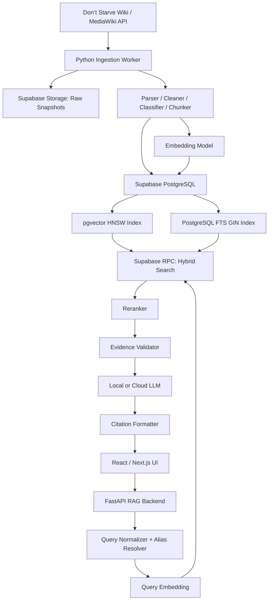

# PROJECT PLANNING — Vietnamese RAG Assistant for Don’t Starve Together

> Tên làm việc: **DST Vietnamese Knowledge Assistant**  
> Loại sản phẩm: Web chatbot sử dụng Retrieval-Augmented Generation (RAG)  
> Kiến trúc lưu trữ: **Supabase-backed**  
> Nguồn tri thức chính: Don’t Starve Wiki trên wiki.gg  
> Ngôn ngữ giao diện và trả lời: Tiếng Việt  
> Trạng thái tài liệu: Implementation-ready  
> Phiên bản planning: **2.0 — Supabase Architecture**  
> Ngày cập nhật: 2026-07-15

---

## 1. Tóm tắt dự án

Xây dựng một hệ thống hỏi đáp bằng tiếng Việt về **Don’t Starve Together (DST)**. Người dùng có thể hỏi về item, nhân vật, mob, boss, công thức chế tạo, thức ăn, mechanic, mùa, biome và hướng dẫn chơi mà không phải tự mở và tìm kiếm thủ công trên wiki.

Hệ thống không xây lại Don’t Starve Wiki. Nó tạo một lớp truy xuất và hỏi đáp tiếng Việt trên corpus đã được đồng bộ từ wiki, với các mục tiêu:

- Tìm đúng thông tin khi người dùng hỏi bằng tiếng Việt, tiếng Anh, tiếng Việt không dấu hoặc tên gọi cộng đồng.
- Chỉ trả lời dựa trên bằng chứng đã được truy xuất.
- Hiển thị nguồn cho các phát biểu quan trọng.
- Phân biệt nội dung của Don’t Starve Together với Don’t Starve bản đơn và các DLC khác.
- Lưu knowledge base tập trung trên Supabase để nhiều thiết bị hoặc nhiều instance backend có thể dùng chung.
- Cập nhật corpus theo revision của wiki thay vì tải lại toàn bộ.
- Có thể dùng local LLM hoặc cloud LLM mà không thay đổi lớp lưu trữ và retrieval.

Sản phẩm cuối không phải một wiki mới và cũng không phải một chatbot “biết mọi thứ”. Nó là một **source-grounded Vietnamese RAG assistant chuyên biệt cho DST**, trong đó Supabase là nơi lưu trữ và truy vấn knowledge base chính.

---

## 2. Quyết định kiến trúc cốt lõi

### 2.1. Supabase là source of truth

Knowledge base chính được lưu trên Supabase:

```text
Supabase PostgreSQL
├── wiki_pages
├── document_chunks
├── entity_aliases
├── source_attributions
├── sync_runs
├── corpus_versions
├── evaluation_questions
└── embeddings thông qua pgvector

Supabase Storage
├── dst-wiki-raw
├── dst-corpus-snapshots
└── dst-evaluation-reports
```

Không sử dụng SQLite, FAISS hoặc JSONL local làm production source of truth.

### 2.2. Vai trò của máy local hoặc server worker

Máy local, VPS hoặc CI runner chỉ dùng để:

- Gọi MediaWiki API.
- Làm sạch và chunk dữ liệu.
- Tạo embedding.
- Upsert dữ liệu vào Supabase.
- Chạy backend FastAPI.
- Chạy local LLM nếu chọn Ollama.
- Lưu cache tạm có thể xóa và tái tạo.

### 2.3. Thành phần thay thế

Kiến trúc cũ:

```text
SQLite + JSONL + FAISS + local folders
```

được thay bằng:

```text
Supabase PostgreSQL
+ pgvector
+ PostgreSQL Full-Text Search
+ Supabase Storage
```

### 2.4. Không yêu cầu offline hoàn toàn

Sau khi chuyển sang Supabase:

- Backend cần internet để truy vấn Supabase.
- Frontend cần internet hoặc kết nối mạng tới backend.
- Local LLM vẫn có thể chạy offline đối với generation, nhưng retrieval vẫn phụ thuộc Supabase.
- Offline mode chỉ là tính năng tương lai, không thuộc MVP.

---

## 3. Bối cảnh và vấn đề

Don’t Starve Wiki trên wiki.gg đã có lượng nội dung lớn và khá đầy đủ. Tuy nhiên, người chơi tiếng Việt vẫn gặp các khó khăn:

1. Phần lớn nội dung chi tiết bằng tiếng Anh.
2. Search theo tên tiếng Việt, tên không dấu hoặc tên gọi cộng đồng chưa thuận tiện.
3. Người dùng phải mở nhiều trang để tổng hợp câu trả lời.
4. Câu hỏi so sánh hoặc câu hỏi nhiều bước thường cần đọc nhiều section.
5. Nội dung giữa Don’t Starve, DST và DLC có thể bị nhầm lẫn.
6. Một số guide mang tính chủ quan hoặc có thể cũ theo phiên bản game.
7. Chatbot thông thường có nguy cơ hallucination nếu không gắn chặt với nguồn.
8. Knowledge base local khó chia sẻ giữa nhiều thiết bị hoặc deploy thành website.
9. Khi dùng nhiều backend instance, index local dễ mất đồng bộ.

Dự án giải quyết bằng cách:

- Đồng bộ corpus từ wiki vào Supabase.
- Chuẩn hóa metadata và phạm vi DST.
- Lưu chunk, embedding và full-text index trong cùng PostgreSQL database.
- Dùng hybrid retrieval: Full-Text Search + pgvector.
- Rerank bằng mô hình đa ngôn ngữ.
- Sinh câu trả lời tiếng Việt dựa trên context đã truy xuất.
- Hiển thị citation và trạng thái độ tin cậy.
- Quản lý revision, corpus version và incremental sync tập trung.

---

## 4. Mục tiêu

### 4.1. Mục tiêu chính

- Cho phép người dùng hỏi đáp tự nhiên bằng tiếng Việt về DST.
- Trả lời chính xác dựa trên Don’t Starve Wiki.
- Hỗ trợ tên tiếng Anh, tiếng Việt, không dấu, alias và lỗi gõ nhẹ.
- Trả lời có citation dẫn về đúng trang và section.
- Không trả lời factual khi không có đủ bằng chứng.
- Lưu knowledge base tập trung trên Supabase.
- Truy cập được từ nhiều thiết bị và backend instance.
- Cập nhật corpus theo revision thay vì crawl lại toàn bộ.
- Có thể thay embedding model, reranker hoặc LLM mà không thay đổi toàn bộ hệ thống.

### 4.2. Mục tiêu chất lượng

- Retrieval Recall@5 trên tập test entity: tối thiểu 90%.
- Retrieval Recall@10 trên câu hỏi mô tả tự nhiên: tối thiểu 85%.
- Citation correctness: tối thiểu 95%.
- Không trộn nội dung DST và phiên bản khác trong ít nhất 98% test case.
- Tỷ lệ câu trả lời factual không có evidence: 0%.
- Search/retrieval p95:
  - Mục tiêu dưới 1.5 giây từ backend đến Supabase và quay lại.
- Câu trả lời hoàn chỉnh:
  - Cloud LLM: mục tiêu p95 dưới 10 giây.
  - Local LLM: mục tiêu p95 dưới 20 giây, phụ thuộc phần cứng.
- Hỗ trợ hoàn chỉnh Unicode tiếng Việt và truy vấn không dấu.
- Incremental sync không làm gián đoạn phiên bản corpus đang phục vụ.

---

## 5. Ngoài phạm vi

Không triển khai trong MVP:

- Xây lại website encyclopedia đầy đủ như wiki.gg.
- Hệ thống tài khoản người dùng.
- Bookmark, favorites hoặc search history cá nhân.
- Cho người dùng chỉnh sửa bài viết như MediaWiki.
- Revision editor, talk page, comment, moderator hoặc community CMS.
- Tải và phát lại video YouTube.
- Phân tích trực tiếp trạng thái game hoặc đọc save file.
- Nhận diện item từ ảnh.
- Hỗ trợ mod cộng đồng.
- Fine-tune LLM từ đầu.
- Tự động khẳng định thông tin ngoài corpus.
- Sao chép hàng loạt hình ảnh hoặc asset game khi chưa xác minh quyền sử dụng.
- Offline knowledge base đầy đủ.
- Supabase Auth.
- Realtime subscription.
- Edge Function orchestration phức tạp.
- Automatic embedding bằng trigger/queue trong MVP.

Các chức năng này chỉ được xem xét sau khi MVP đạt tiêu chí nghiệm thu.

---

## 6. Đối tượng sử dụng

### 6.1. Người mới chơi

- “Làm sao để sống sót qua mùa đông đầu tiên?”
- “Sanity là gì?”
- “Làm sao hồi sinh đồng đội?”
- “Món nào dễ nấu và hồi đói tốt?”

### 6.2. Người chơi đã có kinh nghiệm

- “So sánh Football Helmet với Battle Helm.”
- “Wendy nên chuẩn bị gì khi đánh Spider Queen?”
- “Món ăn nào hồi máu hiệu quả theo chi phí?”
- “Cách hoạt động của planar damage là gì?”

### 6.3. Người chơi không nhớ tên chính xác

- “Cục đá để giữ nhiệt.”
- “Mũ làm từ da heo.”
- “Nhân vật đi cùng con ma.”
- “Trái tim dùng để cứu đồng đội.”

---

## 7. Use case bắt buộc

### UC-01 — Tra cứu entity

**Input:** “Thermal Stone dùng để làm gì?”  
**Expected:** Nhận diện Thermal Stone, lấy section phù hợp, trả lời ngắn gọn, kèm nguồn.

### UC-02 — Tìm theo tên tiếng Việt

**Input:** “Mũ da heo chế như thế nào?”  
**Expected:** Alias resolver ánh xạ sang Football Helmet.

### UC-03 — Tìm không dấu

**Input:** “mu da heo”  
**Expected:** Kết quả tương đương truy vấn có dấu.

### UC-04 — Tìm theo mô tả

**Input:** “Đồ nào giúp chống lạnh?”  
**Expected:** Truy xuất nhiều entity và mechanic liên quan.

### UC-05 — So sánh

**Input:** “Football Helmet và Log Suit khác nhau thế nào?”  
**Expected:** Lấy context của cả hai entity, trình bày các điểm khác biệt có nguồn.

### UC-06 — Câu hỏi theo nhân vật

**Input:** “Wendy có phù hợp cho người mới không?”  
**Expected:** Phân biệt factual article và guide chủ quan.

### UC-07 — Câu hỏi nhiều nguồn

**Input:** “Tôi chơi Wendy và chuẩn bị đánh Spider Queen thì nên mang gì?”  
**Expected:** Truy xuất Wendy, Abigail, Spider Queen, armor, healing food và guide phù hợp.

### UC-08 — Không đủ dữ liệu

**Expected:** Từ chối suy đoán và nêu phạm vi nguồn hiện tại.

### UC-09 — Nhầm phiên bản

**Expected:** Ưu tiên DST; không trộn dữ liệu với bản đơn hoặc DLC.

### UC-10 — Citation

**Expected:** Citation mở được trang nguồn và hiển thị section/revision.

### UC-11 — Truy cập đa thiết bị

**Expected:** Cùng một knowledge base được sử dụng từ nhiều frontend/backend instance mà không cần copy index local.

### UC-12 — Incremental sync

**Expected:** Trang có revision mới được cập nhật; các trang không đổi không bị xử lý lại.

---

## 8. Phạm vi dữ liệu

### 8.1. Nhóm dữ liệu ưu tiên trong MVP

1. Characters.
2. Character abilities và character-specific items.
3. Items.
4. Weapons và armor.
5. Tools.
6. Foods và Crock Pot recipes.
7. Structures và crafting stations.
8. Mobs và bosses.
9. Core mechanics:
   - Health
   - Hunger
   - Sanity
   - Temperature
   - Wetness
   - Insulation
   - Damage
   - Armor
   - Durability
   - Perish time
   - Planar damage/defense nếu dữ liệu đủ rõ
10. Seasons và survival basics.
11. Selected beginner guides.
12. Version/change-log pages cần thiết để xác minh thay đổi.

### 8.2. Không thu thập trong MVP

- Character quotes đầy đủ.
- Gallery lớn.
- Skin và Curio catalogs.
- Trivia không liên quan gameplay.
- User pages, talk pages và forum threads.
- Fan fiction hoặc nội dung không có giá trị hỏi đáp.
- Trang thuộc mod.
- Trang không liên quan DST.
- File/media dung lượng lớn nếu chỉ cần văn bản.

### 8.3. Quy tắc xác định nội dung DST

Mỗi page và chunk phải có trường `game_scope`:

- `dst`
- `dont_starve`
- `reign_of_giants`
- `shipwrecked`
- `hamlet`
- `mixed`
- `unknown`

MVP chỉ retrieval:

```text
game_scope = dst
OR game_scope = mixed và section được xác định rõ là DST
```

Chunk `unknown` không được dùng cho câu trả lời factual mặc định.

---

## 9. Nguồn dữ liệu và chính sách nguồn

### 9.1. Nguồn chính

- Don’t Starve Wiki trên wiki.gg.
- Category và trang dành riêng cho Don’t Starve Together.
- Trang Characters, Items, Guides, Mechanics và các entity liên quan.

### 9.2. Nguồn phụ trong tương lai

- Klei official patch notes.
- Local game scripts.
- Klei forums.
- Video/transcript được tuyển chọn.

### 9.3. Thứ tự ưu tiên bằng chứng tương lai

1. Official game data hoặc official Klei update.
2. Trang factual của wiki.
3. Wiki version history/change log.
4. Wiki guide.
5. Nguồn cộng đồng khác.

Trong MVP, phân biệt:

- `factual_article`
- `guide`
- `version_history`
- `category_list`
- `unknown`

Guide phải có `subjective = true`.

---

## 10. Kiến trúc tổng thể



### 10.1. Thành phần

#### Frontend

- React hoặc Next.js.
- Không truy cập trực tiếp bảng knowledge base.
- Chỉ gọi FastAPI.

#### FastAPI backend

- Query normalization.
- Alias resolution.
- Query embedding.
- Gọi Supabase RPC.
- Reranking.
- Evidence validation.
- LLM generation.
- Citation formatting.

#### Supabase PostgreSQL

- Lưu pages, chunks, aliases, revision và corpus version.
- Lưu embedding bằng pgvector.
- Tạo Full-Text Search index.
- Cung cấp RPC hybrid search.
- Là source of truth.

#### Supabase Storage

- Lưu raw MediaWiki JSON.
- Lưu HTML fallback.
- Lưu corpus snapshots và evaluation reports.
- Bucket mặc định là private.

#### Ingestion worker

- Chạy trên local, VPS, Railway/Render worker hoặc GitHub Actions.
- Dùng backend-only Supabase key.
- Không chạy trong browser.

#### LLM

- Có thể là Ollama local.
- Có thể là cloud provider.
- Không ảnh hưởng schema knowledge base.

### 10.2. Nguyên tắc kiến trúc

- Server-backed.
- Supabase là source of truth.
- API-first giữa frontend và backend.
- Retrieval tách khỏi generation.
- LLM không truy cập trực tiếp internet khi trả lời.
- Mọi factual answer truy ngược được về evidence.
- Không expose service-role/secret key ra frontend.
- Schema và migrations được version control.
- Corpus update phải atomic hoặc có cơ chế active version.
- Không hard-code toàn bộ page list trong code.

---

## 11. Công nghệ đề xuất

### 11.1. Backend và worker

- Python 3.12+.
- FastAPI.
- Pydantic.
- `supabase-py` hoặc PostgreSQL client phù hợp.
- HTTPX.
- Tenacity.
- BeautifulSoup/lxml cho fallback parse.
- pytest.

### 11.2. Frontend

- Next.js hoặc React + Vite.
- TypeScript.
- Markdown renderer có sanitize.
- Không cần authentication.

### 11.3. Database và search

- Supabase PostgreSQL.
- Extension `vector`/pgvector.
- HNSW vector index.
- PostgreSQL Full-Text Search.
- GIN index.
- PostgreSQL RPC function cho hybrid search.
- Reciprocal Rank Fusion hoặc weighted rank combination.

### 11.4. File/object storage

- Supabase Storage.
- Private buckets.
- Signed URL chỉ khi UI cần xem raw snapshot.
- Raw file không public mặc định.

### 11.5. Embedding và reranker

Ưu tiên benchmark:

- BGE-M3.
- multilingual-e5.
- BGE reranker multilingual hoặc tương đương.

Model và embedding dimension phải cấu hình rõ. Khi thay model có dimension khác, phải tạo migration/index version mới.

### 11.6. LLM

Local:

- Ollama.
- Model họ Qwen hoặc model có tiếng Việt tốt.

Cloud tùy chọn:

- Chỉ bật qua environment variable.
- Không gửi raw corpus hàng loạt.
- Chỉ gửi retrieved context cần thiết.

### 11.7. Không sử dụng trong MVP

- FAISS.
- SQLite.
- Qdrant.
- Elasticsearch.
- Meilisearch.
- Supabase Auth.
- Supabase Realtime.
- LangChain bắt buộc.
- Edge Functions bắt buộc.

---

## 12. Cấu trúc repository

```text
dst-vietnamese-rag/
├── README.md
├── planning.md
├── IMPLEMENTATION_STATUS.md
├── LICENSE
├── .env.example
├── docker-compose.yml
├── Makefile
│
├── supabase/
│   ├── config.toml
│   ├── migrations/
│   │   ├── 0001_extensions.sql
│   │   ├── 0002_core_tables.sql
│   │   ├── 0003_search_indexes.sql
│   │   ├── 0004_hybrid_search_rpc.sql
│   │   ├── 0005_rls_and_grants.sql
│   │   └── 0006_storage_policies.sql
│   └── seed.sql
│
├── apps/
│   ├── api/
│   │   ├── main.py
│   │   ├── routes/
│   │   ├── schemas/
│   │   ├── dependencies/
│   │   └── middleware/
│   └── web/
│       ├── src/
│       ├── public/
│       └── package.json
│
├── src/
│   ├── config/
│   ├── ingestion/
│   │   ├── mediawiki_client.py
│   │   ├── page_discovery.py
│   │   ├── page_fetcher.py
│   │   ├── sync_manager.py
│   │   ├── storage_uploader.py
│   │   └── html_fallback.py
│   │
│   ├── processing/
│   │   ├── cleaner.py
│   │   ├── section_parser.py
│   │   ├── scope_classifier.py
│   │   ├── entity_classifier.py
│   │   ├── chunker.py
│   │   └── normalizer.py
│   │
│   ├── vietnamese/
│   │   ├── text_normalization.py
│   │   ├── alias_resolver.py
│   │   ├── glossary.py
│   │   └── query_expansion.py
│   │
│   ├── embeddings/
│   │   ├── embedding_client.py
│   │   ├── batch_embedder.py
│   │   └── model_manifest.py
│   │
│   ├── supabase_store/
│   │   ├── client.py
│   │   ├── page_repository.py
│   │   ├── chunk_repository.py
│   │   ├── alias_repository.py
│   │   ├── storage_repository.py
│   │   └── corpus_repository.py
│   │
│   ├── retrieval/
│   │   ├── query_router.py
│   │   ├── hybrid_search_client.py
│   │   ├── reranker.py
│   │   ├── evidence_filter.py
│   │   └── citation_builder.py
│   │
│   ├── generation/
│   │   ├── llm_client.py
│   │   ├── prompts.py
│   │   ├── answer_generator.py
│   │   └── guardrails.py
│   │
│   └── evaluation/
│       ├── retrieval_eval.py
│       ├── answer_eval.py
│       └── citation_eval.py
│
├── data/
│   ├── glossary/
│   ├── evaluation/
│   ├── fixtures/
│   └── cache/
│
├── scripts/
│   ├── check_supabase.py
│   ├── discover_pages.py
│   ├── sync_wiki.py
│   ├── rebuild_embeddings.py
│   ├── activate_corpus.py
│   ├── export_corpus.py
│   ├── evaluate.py
│   └── serve.py
│
└── tests/
    ├── unit/
    ├── integration/
    └── e2e/
```

`data/cache/` chỉ là cache tạm, không phải source of truth.

---

## 13. Thiết kế Supabase

### 13.1. Extensions

Migration đầu tiên:

```sql
create extension if not exists vector with schema extensions;
create extension if not exists pg_trgm with schema extensions;
create extension if not exists unaccent with schema extensions;
```

Lưu ý:

- Xác minh extension khả dụng trên project Supabase thực tế.
- Không dựa hoàn toàn vào `unaccent` cho tiếng Việt; backend vẫn tạo text normalized không dấu.
- Schema của `vector` phải dùng nhất quán trong SQL.

### 13.2. Schemas

Khuyến nghị:

```text
public
├── public read-only views hoặc RPC cần thiết

knowledge
├── wiki_pages
├── document_chunks
├── entity_aliases
├── source_attributions
├── corpus_versions
├── sync_runs
└── embedding_models
```

Nếu Supabase Data API không expose custom schema theo cấu hình mong muốn, có thể dùng `public` nhưng phải quản lý grants/RLS chặt chẽ.

### 13.3. Storage buckets

#### `dst-wiki-raw`

- Private.
- Lưu JSON/HTML gốc.
- Path:

```text
pages/{page_id}/{revision_id}.json
pages/{page_id}/{revision_id}.html
```

#### `dst-corpus-snapshots`

- Private.
- Lưu export định kỳ:

```text
corpus/{corpus_version}/chunks.jsonl.gz
corpus/{corpus_version}/manifest.json
```

#### `dst-evaluation-reports`

- Private.
- Lưu:

```text
runs/{timestamp}/retrieval.json
runs/{timestamp}/generation.json
runs/{timestamp}/summary.md
```

### 13.4. Public/private access

Mặc định:

- Không public bucket.
- Không frontend upload.
- Không frontend ghi database.
- Backend/worker dùng server-side secret hoặc service-role key.
- Frontend chỉ gọi FastAPI.
- RLS và grants vẫn phải cấu hình, không dựa riêng vào việc giấu key.

---

## 14. Mô hình dữ liệu

### 14.1. `embedding_models`

```sql
create table knowledge.embedding_models (
    id uuid primary key default gen_random_uuid(),
    model_key text not null unique,
    provider text not null,
    model_name text not null,
    dimensions integer not null,
    distance_metric text not null default 'cosine',
    normalized boolean not null default true,
    created_at timestamptz not null default now(),
    is_active boolean not null default false
);
```

### 14.2. `corpus_versions`

```sql
create table knowledge.corpus_versions (
    id uuid primary key default gen_random_uuid(),
    version text not null unique,
    status text not null check (
        status in ('building', 'validating', 'active', 'failed', 'archived')
    ),
    embedding_model_key text not null,
    page_count integer not null default 0,
    chunk_count integer not null default 0,
    source_revision_max bigint,
    started_at timestamptz not null default now(),
    completed_at timestamptz,
    activated_at timestamptz,
    manifest jsonb not null default '{}'::jsonb
);
```

Chỉ một corpus version được active tại một thời điểm.

Có thể dùng partial unique index:

```sql
create unique index one_active_corpus_version
on knowledge.corpus_versions ((status))
where status = 'active';
```

### 14.3. `wiki_pages`

```sql
create table knowledge.wiki_pages (
    id uuid primary key default gen_random_uuid(),
    mediawiki_page_id bigint not null,
    title text not null,
    slug text,
    canonical_url text not null,
    namespace integer,
    revision_id bigint not null,
    revision_timestamp timestamptz,
    retrieved_at timestamptz not null default now(),
    content_hash text not null,
    game_scope text not null,
    entity_type text,
    source_kind text,
    language text not null default 'en',
    raw_storage_bucket text,
    raw_storage_path text,
    is_active boolean not null default true,
    metadata jsonb not null default '{}'::jsonb,
    unique(mediawiki_page_id, revision_id)
);
```

### 14.4. `document_chunks`

Vector dimension phải được thay bằng dimension thật của model, ví dụ `1024`.

```sql
create table knowledge.document_chunks (
    id uuid primary key default gen_random_uuid(),
    corpus_version_id uuid not null
        references knowledge.corpus_versions(id) on delete cascade,
    wiki_page_id uuid not null
        references knowledge.wiki_pages(id) on delete cascade,

    page_title text not null,
    section_path text,
    chunk_index integer not null,

    content text not null,
    content_normalized text not null,
    content_hash text not null,
    token_count integer,

    game_scope text not null,
    entity_type text,
    source_kind text,
    subjective boolean not null default false,

    canonical_url text not null,
    revision_id bigint,

    search_text text not null,
    fts tsvector generated always as (
        to_tsvector('simple', coalesce(search_text, ''))
    ) stored,

    embedding extensions.vector(1024),

    metadata jsonb not null default '{}'::jsonb,
    created_at timestamptz not null default now(),

    unique(corpus_version_id, wiki_page_id, section_path, chunk_index)
);
```

Yêu cầu:

- `content` giữ nguyên nội dung đã làm sạch.
- `content_normalized` là phiên bản lowercase/không dấu cho retrieval phụ trợ.
- `search_text` kết hợp title, aliases, section, content và normalized variants.
- Không lưu embedding nếu job chưa hoàn tất; trạng thái được quản lý qua metadata hoặc bảng job riêng.
- Khi model đổi dimension, tạo table/column migration mới hoặc versioned chunk table; không cố ép vector dimension khác vào cột cũ.

### 14.5. Indexes

```sql
create index document_chunks_fts_idx
on knowledge.document_chunks
using gin (fts);

create index document_chunks_embedding_hnsw_idx
on knowledge.document_chunks
using hnsw (embedding vector_cosine_ops);

create index document_chunks_scope_idx
on knowledge.document_chunks (game_scope, entity_type);

create index document_chunks_corpus_idx
on knowledge.document_chunks (corpus_version_id);

create index wiki_pages_mediawiki_id_idx
on knowledge.wiki_pages (mediawiki_page_id);

create index wiki_pages_revision_idx
on knowledge.wiki_pages (revision_id);
```

Chỉ tạo HNSW sau khi xác minh:

- Embedding đã được điền.
- Distance operator phù hợp.
- Extension/schema đúng.
- Supabase compute đủ tài nguyên để build index.

### 14.6. `entity_aliases`

```sql
create table knowledge.entity_aliases (
    id uuid primary key default gen_random_uuid(),
    entity_title text not null,
    entity_slug text,
    alias text not null,
    alias_normalized text not null,
    language text not null,
    alias_type text not null,
    priority integer not null default 0,
    confidence numeric(5,4),
    verified boolean not null default false,
    source text,
    metadata jsonb not null default '{}'::jsonb,
    unique(entity_title, alias_normalized)
);
```

`alias_type`:

- `official_title`
- `official_translation`
- `community_translation`
- `abbreviation`
- `common_misspelling`
- `descriptive_alias`
- `generated_candidate`

### 14.7. `source_attributions`

```sql
create table knowledge.source_attributions (
    id uuid primary key default gen_random_uuid(),
    wiki_page_id uuid not null
        references knowledge.wiki_pages(id) on delete cascade,
    source_name text not null,
    source_url text not null,
    license_name text,
    attribution_text text,
    metadata jsonb not null default '{}'::jsonb
);
```

### 14.8. `sync_runs`

```sql
create table knowledge.sync_runs (
    id uuid primary key default gen_random_uuid(),
    status text not null check (
        status in ('running', 'succeeded', 'failed', 'cancelled')
    ),
    sync_type text not null check (
        sync_type in ('initial', 'incremental', 'rebuild_embeddings')
    ),
    started_at timestamptz not null default now(),
    finished_at timestamptz,
    pages_discovered integer not null default 0,
    pages_fetched integer not null default 0,
    pages_changed integer not null default 0,
    chunks_created integer not null default 0,
    error_count integer not null default 0,
    details jsonb not null default '{}'::jsonb
);
```

### 14.9. Optional `embedding_jobs`

Chỉ thêm nếu cần job resumable:

```sql
create table knowledge.embedding_jobs (
    id uuid primary key default gen_random_uuid(),
    chunk_id uuid not null
        references knowledge.document_chunks(id) on delete cascade,
    status text not null,
    attempts integer not null default 0,
    last_error text,
    locked_at timestamptz,
    completed_at timestamptz
);
```

MVP có thể embed trong Python worker trước khi insert/upsert để tránh queue phức tạp.

---

## 15. Hybrid search RPC

### 15.1. Mục tiêu

Một RPC nhận:

- Query text.
- Query embedding.
- Active corpus version.
- Game scope.
- Entity filters.
- K lexical candidates.
- K semantic candidates.
- Final result count.

### 15.2. Kết hợp thứ hạng

Ưu tiên Reciprocal Rank Fusion:

```text
RRF score =
1 / (rrf_k + lexical_rank)
+
1 / (rrf_k + semantic_rank)
+
entity_boost
+
section_intent_boost
```

Không cộng trực tiếp raw BM25 score và cosine score nếu chưa normalize, vì hai thang điểm khác nhau.

### 15.3. SQL skeleton

```sql
create or replace function public.hybrid_search_dst(
    query_text text,
    query_embedding extensions.vector(1024),
    match_count integer default 8,
    lexical_count integer default 40,
    semantic_count integer default 40,
    filter_entity_type text default null
)
returns table (
    chunk_id uuid,
    page_title text,
    section_path text,
    content text,
    canonical_url text,
    revision_id bigint,
    entity_type text,
    source_kind text,
    subjective boolean,
    score double precision
)
language sql
stable
security invoker
as $$
with active_corpus as (
    select id
    from knowledge.corpus_versions
    where status = 'active'
    limit 1
),
lexical as (
    select
        c.id,
        row_number() over (
            order by ts_rank_cd(c.fts, websearch_to_tsquery('simple', query_text)) desc
        ) as rank
    from knowledge.document_chunks c
    join active_corpus a on a.id = c.corpus_version_id
    where
        c.game_scope = 'dst'
        and c.fts @@ websearch_to_tsquery('simple', query_text)
        and (filter_entity_type is null or c.entity_type = filter_entity_type)
    order by rank
    limit lexical_count
),
semantic as (
    select
        c.id,
        row_number() over (
            order by c.embedding <=> query_embedding
        ) as rank
    from knowledge.document_chunks c
    join active_corpus a on a.id = c.corpus_version_id
    where
        c.game_scope = 'dst'
        and c.embedding is not null
        and (filter_entity_type is null or c.entity_type = filter_entity_type)
    order by rank
    limit semantic_count
),
combined as (
    select
        coalesce(l.id, s.id) as id,
        coalesce(1.0 / (60 + l.rank), 0.0)
        + coalesce(1.0 / (60 + s.rank), 0.0) as score
    from lexical l
    full outer join semantic s on l.id = s.id
)
select
    c.id,
    c.page_title,
    c.section_path,
    c.content,
    c.canonical_url,
    c.revision_id,
    c.entity_type,
    c.source_kind,
    c.subjective,
    combined.score
from combined
join knowledge.document_chunks c on c.id = combined.id
order by combined.score desc
limit match_count;
$$;
```

Đây là skeleton, agent phải:

- Kiểm tra syntax trên Supabase thật.
- Benchmark query plan.
- Thêm alias/entity boosts ở backend hoặc SQL.
- Thêm normalized text search nếu query không dấu.
- Không expose RPC rộng ra frontend nếu không cần.
- Thiết lập grants phù hợp.

### 15.4. Search không dấu

Backend tạo:

- `query_original`
- `query_normalized`
- alias-expanded terms

`search_text` chứa cả bản có dấu và không dấu.

Ví dụ:

```text
Football Helmet
Mũ bóng bầu dục
Mu bong bau duc
Mũ da heo
Mu da heo
```

RPC lexical search có thể dùng chuỗi expanded đã được backend kiểm soát.

---

## 16. Bảo mật Supabase

### 16.1. Key usage

#### Frontend

- Không chứa secret key.
- Không chứa service-role key.
- Không truy cập trực tiếp knowledge tables trong MVP.

#### FastAPI backend

- Dùng server-side Supabase secret/service-role key nếu cần quyền quản trị.
- Key chỉ trong environment secret.
- Không log key.
- Tách client read và admin nếu cần.

#### Ingestion worker

- Dùng server-side secret/service-role key.
- Có quyền insert/update Storage và database.
- Chỉ chạy trong trusted environment.

### 16.2. RLS

Bật RLS trên tables được expose qua Data API.

Phương án khuyến nghị:

- Knowledge tables không cho `anon` ghi.
- Không cho `anon` đọc trực tiếp.
- Backend gọi RPC/table bằng server-side credential.
- Admin tables không expose public.

Ví dụ:

```sql
alter table knowledge.wiki_pages enable row level security;
alter table knowledge.document_chunks enable row level security;
alter table knowledge.entity_aliases enable row level security;
```

Nếu backend dùng service-role/secret key, nó có thể bypass RLS; vì vậy bảo mật backend trở thành bắt buộc.

### 16.3. Grants

- Revoke quyền không cần thiết khỏi `anon` và `authenticated`.
- Chỉ grant execute cho RPC cần thiết nếu frontend gọi trực tiếp trong tương lai.
- MVP: frontend không gọi Supabase trực tiếp.
- Review grants sau mỗi migration.

### 16.4. Storage access

- Bucket private.
- Upload chỉ từ worker/backend.
- Signed URL ngắn hạn nếu cần xem raw evidence.
- Không tạo public URL cho raw corpus.
- Có RLS policy trên `storage.objects`.

### 16.5. Network và secrets

- `SUPABASE_URL` có thể public nhưng vẫn để ở backend trong MVP.
- Secret/service-role key chỉ ở backend.
- LLM provider key chỉ ở backend.
- MediaWiki User-Agent contact không chứa secret.
- Có secret scanning trong CI.

---

## 17. Pipeline thu thập dữ liệu

### 17.1. Ưu tiên MediaWiki API

Quy trình:

1. Xác minh API endpoint.
2. Lấy `siteinfo`.
3. Discover pages qua category/allpages/backlinks/search.
4. Lấy page ID, title, revision ID, timestamp và content.
5. Upload raw response vào Supabase Storage.
6. Upsert metadata vào `wiki_pages`.
7. Chỉ parse page mới hoặc revision thay đổi.
8. Làm sạch, classify và chunk.
9. Tạo embedding.
10. Insert chunks vào corpus version đang `building`.
11. Validate.
12. Activate corpus version atomically.

### 17.2. API etiquette

- User-Agent mô tả rõ ứng dụng.
- Concurrency thấp.
- Batch title nếu API hỗ trợ.
- Gzip.
- Retry/backoff.
- Cache.
- Không traffic liên tục không cần thiết.
- Ghi request count và error rate.

### 17.3. Page discovery

Hỗ trợ:

- Category traversal giới hạn depth.
- Namespace allowlist.
- Title denylist.
- Category denylist.
- Deduplicate theo MediaWiki page ID.
- Chặn vòng lặp.

### 17.4. Raw object upload

Path deterministic:

```text
pages/{mediawiki_page_id}/{revision_id}.json
```

Metadata object:

```json
{
  "page_id": 12345,
  "revision_id": 98765,
  "title": "Football Helmet",
  "content_hash": "...",
  "retrieved_at": "..."
}
```

Không upload lại nếu object cùng revision/hash đã tồn tại.

### 17.5. Fallback HTML

Chỉ dùng khi API không cung cấp nội dung cần thiết.

- Tôn trọng robots/policy.
- Không bypass anti-bot.
- Lưu HTML vào Storage.
- Gắn `fetch_method = html_fallback`.

---

## 18. Làm sạch và chuẩn hóa corpus

### 18.1. Loại bỏ

- Navigation.
- Table of contents lặp.
- Footer.
- Edit buttons.
- Advertisement/site chrome.
- Gallery caption rỗng.
- Boilerplate không có giá trị.

### 18.2. Giữ lại

- Heading hierarchy.
- Paragraph.
- Bullet list.
- Infobox factual fields.
- Table gameplay.
- Warning/note.
- Internal link text.
- Version-specific labels.
- Guide disclaimer.
- Source URL và revision metadata.

### 18.3. Chuẩn hóa bảng

```text
Field: Health
Value: 150
```

Không flatten bảng thành chuỗi không có cấu trúc.

### 18.4. Phân loại entity

- `character`
- `item`
- `weapon`
- `armor`
- `tool`
- `food`
- `recipe`
- `structure`
- `mob`
- `boss`
- `mechanic`
- `biome`
- `season`
- `guide`
- `update`
- `other`

Ưu tiên classifier:

1. Category metadata.
2. Infobox/template.
3. Title rule.
4. Text classifier fallback.

---

## 19. Chunking

### 19.1. Nguyên tắc

Chunk theo:

- Page.
- Section.
- Subsection.
- Semantic block.
- Table hoặc list nguyên vẹn.

Không chunk máy móc theo mỗi N ký tự.

### 19.2. Header context

Mỗi chunk prepend:

```text
Page: Football Helmet
Section: Crafting
Game: Don't Starve Together
Entity type: Armor
```

### 19.3. Kích thước khởi điểm

- 250–600 tokens.
- Overlap 40–80 tokens cho section dài.
- Không tách stat/recipe table.
- Không gộp Strategy và Trivia.
- Benchmark trước khi chốt.

### 19.4. Chunk identity

Deterministic source key:

```text
sha256(mediawiki_page_id + revision_id + section_path + chunk_index + content_hash)
```

Có thể lưu key này trong metadata hoặc một cột unique riêng để idempotent upsert.

---

## 20. Tối ưu tiếng Việt

### 20.1. Query normalization

1. Unicode NFC.
2. Lowercase.
3. Chuẩn hóa whitespace.
4. Chuẩn hóa apostrophe/dash.
5. Tạo phiên bản không dấu.
6. Giữ bản gốc cho embedding.
7. Phát hiện Việt/Anh/mixed.
8. Chuẩn hóa shorthand.
9. Không tự dịch mù quáng tên riêng.

### 20.2. Glossary

Source of truth glossary có thể lưu trong:

- Git repository: `data/glossary/dst_vi_glossary.csv`.
- Đồng bộ vào `entity_aliases`.

Các cột:

```text
english_term,vietnamese_term,aliases,term_type,notes,verified
```

### 20.3. Query expansion

Nguồn expansion:

1. Verified aliases trong Supabase.
2. Glossary.
3. Rule-based concept map.
4. LLM expansion có giới hạn, không dùng làm evidence.

### 20.4. Typo handling

Kết hợp:

- PostgreSQL trigram hoặc backend fuzzy matching.
- Alias priority.
- Semantic fallback.

---

## 21. Query routing và retrieval

### 21.1. Query types

- `entity_lookup`
- `definition`
- `crafting`
- `acquisition`
- `usage`
- `comparison`
- `recommendation`
- `multi_entity_strategy`
- `version_history`
- `out_of_scope`

### 21.2. Stage 1 — Entity resolution

Thứ tự:

1. Exact title.
2. Exact verified alias.
3. Accent-insensitive exact.
4. Prefix.
5. Trigram/fuzzy.
6. Embedding fallback.

### 21.3. Stage 2 — Hybrid RPC

- Lexical FTS.
- Semantic pgvector.
- Active corpus filter.
- `game_scope = dst`.
- Optional entity type.
- RRF merge.

### 21.4. Stage 3 — Reranking

Rerank top 20–50 candidates xuống 5–10.

Input:

```text
query + page title + section path + chunk content
```

### 21.5. Stage 4 — Evidence filtering

Loại chunk khi:

- Không phải DST.
- Relevance dưới threshold.
- Chỉ là trivia.
- Duplicate.
- Guide không phù hợp intent.
- Conflict không thể giải quyết.
- Không thuộc active corpus.

### 21.6. Context assembly

- Token budget rõ ràng.
- Đa dạng page khi multi-entity.
- Giới hạn số chunk cùng section.
- Citation ID ổn định.
- Chỉ dùng chunk được validator chấp nhận.

---

## 22. Generation

### 22.1. System prompt

```text
Bạn là trợ lý kiến thức Don’t Starve Together bằng tiếng Việt.

Chỉ sử dụng các nguồn được cung cấp trong CONTEXT.
Không sử dụng kiến thức nội tại để bổ sung dữ kiện.
Không tự suy đoán con số, recipe, damage, durability hoặc mechanic.
Phân biệt Don’t Starve Together với Don’t Starve và các DLC.
Mỗi phát biểu factual quan trọng phải có citation [Sx].
Khi nguồn là guide hoặc khuyến nghị chủ quan, phải nói rõ đây là khuyến nghị.
Khi các nguồn mâu thuẫn, trình bày mâu thuẫn và không tự chọn nếu không có quy tắc ưu tiên.
Khi context không đủ, nói rằng chưa có đủ bằng chứng trong nguồn đã lập chỉ mục.
Trả lời bằng tiếng Việt; giữ tên entity tiếng Anh và có thể thêm tên Việt trong ngoặc.
```

### 22.2. Quy tắc

- Trả lời trực tiếp trước.
- Tên entity giữ chuẩn.
- Số liệu có citation.
- Comparison dùng bảng khi phù hợp.
- Recommendation phải nêu tính chủ quan.
- Không bịa link.
- Không dẫn source không được retrieval.
- Không sử dụng raw Storage file làm citation nếu chunk metadata đã có URL gốc.

### 22.3. Abstention

```text
Mình chưa tìm thấy đủ thông tin trong corpus Don’t Starve Together đã được lập chỉ mục để trả lời chính xác câu hỏi này. Câu hỏi có thể thuộc mod, phiên bản khác hoặc nội dung chưa được đồng bộ.
```

---

## 23. Citation

### 23.1. Inline

```text
Football Helmet là một loại giáp đội đầu ... [S1]
```

### 23.2. Source object

```json
{
  "id": "S1",
  "chunk_id": "...",
  "page_title": "Football Helmet",
  "section": "Crafting",
  "url": "...",
  "revision_id": 123456,
  "retrieved_at": "...",
  "corpus_version": "..."
}
```

### 23.3. Validation

- Citation ID tồn tại.
- Chunk thuộc active corpus.
- URL và revision tồn tại.
- Claim được source hỗ trợ.
- Không citation chunk đã bị evidence filter loại.
- Citation không dựa vào embedding vector; vector chỉ dùng tìm kiếm.

---

## 24. API backend

### 24.1. `POST /api/chat`

Request:

```json
{
  "message": "Wendy có phù hợp cho người mới không?",
  "conversation_id": null,
  "filters": {
    "game_scope": "dst"
  }
}
```

Response:

```json
{
  "answer": "...",
  "citations": [],
  "resolved_entities": [],
  "confidence": "high",
  "abstained": false,
  "corpus_version": "2026-07-15.1",
  "latency_ms": {
    "supabase_retrieval": 180,
    "rerank": 240,
    "generation": 4200
  }
}
```

### 24.2. `GET /api/search`

Autocomplete/entity search.

### 24.3. `GET /api/entities/{slug}`

Entity metadata tóm tắt.

### 24.4. `GET /api/sources/{chunk_id}`

Evidence đã dùng. Backend kiểm tra chunk thuộc active/archived corpus hợp lệ.

### 24.5. `GET /api/health`

Kiểm tra:

- Supabase database.
- Hybrid RPC.
- Active corpus.
- Storage bucket access.
- Embedding model.
- LLM endpoint.

### 24.6. Admin endpoints

- `POST /api/admin/sync`
- `POST /api/admin/rebuild-embeddings`
- `POST /api/admin/activate-corpus`
- `GET /api/admin/status`

Yêu cầu:

- Không public mặc định.
- Token riêng hoặc network restriction.
- Không dùng frontend publishable key.
- Ghi audit log.

---

## 25. UI/UX

### 25.1. Màn hình chính

- Khung chat.
- Suggestion chips.
- Trạng thái corpus:
  - Active corpus version.
  - Last sync.
  - Page/chunk count.
  - Embedding model.
- Không hiển thị Supabase credentials.

### 25.2. Câu trả lời

- Markdown sanitize.
- Citation inline.
- Source cards.
- Nút “Xem đoạn nguồn”.
- Nút “Mở trang wiki”.
- Confidence badge.
- Cảnh báo guide chủ quan.
- Resolved alias.

### 25.3. Source drawer

- Page title.
- Section.
- Evidence.
- Revision ID.
- Corpus version.
- Retrieval date.
- Link gốc.

### 25.4. Không cần trong MVP

- Login.
- Persistent conversation history.
- Voice.
- File upload.
- Truy cập Supabase trực tiếp từ browser.

---

## 26. Corpus versioning và cập nhật

### 26.1. Initial sync

1. Tạo `corpus_versions.status = building`.
2. Discover page.
3. Fetch/upload raw.
4. Upsert page metadata.
5. Normalize/chunk.
6. Embed.
7. Insert chunks gắn corpus version.
8. Build/refresh indexes nếu cần.
9. Validate.
10. Chuyển status thành `validating`.
11. Chạy evaluation.
12. Activate atomically.
13. Archive corpus cũ.

### 26.2. Incremental sync

Hai phương án:

#### Phương án A — Build new complete corpus version

An toàn hơn:

- Copy/reuse unchanged chunks.
- Reprocess changed pages.
- Validate.
- Activate toàn bộ version mới.

#### Phương án B — Update active corpus in place

Nhanh hơn nhưng rủi ro:

- Update từng page/chunk.
- Có thể tạo trạng thái nửa cũ nửa mới.
- Không khuyến nghị cho MVP.

MVP nên dùng Phương án A nếu dữ liệu chưa quá lớn.

### 26.3. Atomic activation

Trong transaction:

1. Active corpus hiện tại → `archived`.
2. Corpus mới → `active`.
3. Ghi `activated_at`.
4. Update manifest.

### 26.4. Corpus manifest

```json
{
  "version": "2026-07-15.1",
  "page_count": 250,
  "chunk_count": 2800,
  "embedding_model": "bge-m3",
  "embedding_dimensions": 1024,
  "source_revision_max": 1234567,
  "built_by": "sync-worker",
  "validation_status": "passed"
}
```

### 26.5. Storage snapshots

Sau activation:

- Export metadata/chunks không gồm hoặc có thể gồm embedding tùy dung lượng.
- Nén.
- Upload lên `dst-corpus-snapshots`.
- Lưu object path trong manifest.

---

## 27. Embedding lifecycle

### 27.1. Model manifest

Mỗi embedding model phải có:

- Provider.
- Model name.
- Revision/version.
- Dimensions.
- Distance metric.
- Normalization behavior.
- Batch size.
- Created time.

### 27.2. Khi đổi model

Không update âm thầm cột embedding của active corpus.

Quy trình:

1. Tạo corpus version mới.
2. Embed lại toàn bộ chunks.
3. Tạo/kiểm tra HNSW index phù hợp.
4. Benchmark.
5. Activate nếu đạt quality target.

### 27.3. Automatic embeddings

Supabase hỗ trợ mô hình automatic embeddings bằng Edge Functions, queue và cron, nhưng MVP không bắt buộc.

Lý do chưa dùng:

- Crawl/chunk workflow phức tạp hơn một database trigger.
- Python worker dễ debug.
- Kiểm soát model và batch tốt hơn.
- Tránh phụ thuộc nhiều service trong giai đoạn đầu.

Có thể đưa automatic embeddings vào P2.

---

## 28. Evaluation

### 28.1. Tập đánh giá

Tối thiểu 150 câu:

- 30 entity lookup.
- 20 crafting/acquisition.
- 20 mechanics.
- 20 character.
- 20 comparison.
- 20 strategy/recommendation.
- 10 typo/non-accent.
- 10 out-of-scope.

Có thể lưu source file trong Git và kết quả run trong Supabase Storage.

### 28.2. Retrieval metrics

- Recall@1.
- Recall@5.
- Recall@10.
- MRR.
- nDCG.
- Entity resolution accuracy.
- DST scope accuracy.
- Supabase RPC latency p50/p95.

### 28.3. Generation metrics

- Faithfulness.
- Answer relevance.
- Citation correctness.
- Citation completeness.
- Numerical accuracy.
- Abstention precision/recall.
- Subjectivity labeling.

### 28.4. Regression

Mỗi lần đổi:

- Schema/index.
- FTS config.
- Hybrid RPC.
- Embedding.
- Reranker.
- Prompt.
- LLM.

Phải lưu report:

```text
dst-evaluation-reports/runs/{timestamp}/
```

---

## 29. Test plan

### 29.1. Unit tests

- Vietnamese normalization.
- Remove accents.
- Alias resolver.
- Chunk deterministic key.
- Scope classifier.
- Citation builder.
- Content hash.
- Supabase config validation.
- Corpus state transition validation.

### 29.2. Integration tests

- MediaWiki client fixtures.
- Storage upload/download.
- Database upsert idempotency.
- Hybrid RPC.
- pgvector retrieval.
- FTS retrieval.
- Incremental revision detection.
- Corpus activation transaction.
- API chat.
- LLM mocked.

### 29.3. E2E tests

- Exact entity.
- Không dấu.
- Typo.
- Comparison.
- Out-of-scope.
- Supabase unavailable.
- LLM unavailable.
- Active corpus không tồn tại.
- Storage upload fail.
- Secret key không hợp lệ.

### 29.4. Failure handling

- Wiki timeout/rate limit.
- Supabase database timeout.
- Storage upload error.
- Partial batch insert.
- Embedding provider timeout.
- Vector dimension mismatch.
- HNSW index build fail.
- RPC syntax/query plan issue.
- Corpus activation fail.
- LLM offline.
- Context token overflow.

---

## 30. Logging và observability

Log JSON:

- Request ID.
- Query type.
- Resolved entity.
- Supabase RPC latency.
- Candidate count.
- Rerank latency.
- Generation latency.
- Abstention reason.
- Citation count.
- Corpus version.
- Sync run ID.
- Storage upload count.
- Database error code.

Không log:

- Secret/service-role key.
- LLM API key.
- Full raw corpus.
- Embedding arrays.
- User IP nếu không cần.

Có thể dùng:

- Standard Python logging.
- Sentry/OpenTelemetry trong tương lai.
- Supabase dashboard logs để debug database/API.

---

## 31. Configuration

`.env.example`:

```env
APP_ENV=development
APP_HOST=127.0.0.1
APP_PORT=8000

WIKI_BASE_URL=https://dontstarve.wiki.gg
WIKI_API_URL=
WIKI_USER_AGENT=DSTVietnameseAssistant/0.2 (contact: replace-me)
WIKI_REQUEST_DELAY_MS=500
WIKI_MAX_CONCURRENCY=1

SUPABASE_URL=
SUPABASE_PUBLISHABLE_KEY=
SUPABASE_SECRET_KEY=
# Hoặc legacy/server configuration nếu project vẫn dùng key format cũ:
SUPABASE_SERVICE_ROLE_KEY=

SUPABASE_DB_URL=
SUPABASE_RAW_BUCKET=dst-wiki-raw
SUPABASE_SNAPSHOT_BUCKET=dst-corpus-snapshots
SUPABASE_EVAL_BUCKET=dst-evaluation-reports

EMBEDDING_PROVIDER=local
EMBEDDING_MODEL=
EMBEDDING_DIMENSIONS=1024
EMBEDDING_BATCH_SIZE=32

RERANKER_MODEL=

LLM_PROVIDER=ollama
OLLAMA_BASE_URL=http://localhost:11434
LLM_MODEL=
LLM_TEMPERATURE=0.1

RETRIEVAL_LEXICAL_K=40
RETRIEVAL_SEMANTIC_K=40
RERANK_TOP_K=8
MIN_EVIDENCE_SCORE=
MAX_CONTEXT_TOKENS=

ADMIN_API_TOKEN=
ENABLE_QUERY_LOGGING=false
```

Yêu cầu:

- Không commit `.env`.
- Không đưa secret/service-role key vào frontend.
- Startup phải fail-fast nếu thiếu config bắt buộc.
- Kiểm tra embedding dimension khớp database schema.

---

## 32. Deployment

### 32.1. Phương án đề xuất

```text
Frontend: Vercel
Backend/API: Railway, Render, Fly.io hoặc VPS
Database/Storage: Supabase
LLM: Cloud API hoặc Ollama/vLLM trên server riêng
Ingestion worker: GitHub Actions schedule hoặc worker service
```

### 32.2. MVP đơn giản

```text
Frontend + FastAPI chạy local
Supabase hosted
Ollama local
```

Điều này vẫn cho phép knowledge base nằm trên server.

### 32.3. Production public

- Frontend và backend deploy.
- Backend autoscaling nếu cần.
- Supabase connection pooling.
- Không mở admin endpoints public.
- Rate limit `/api/chat`.
- Cache query embedding hoặc retrieval result nếu hợp lý.
- Theo dõi Supabase quotas và compute.

### 32.4. Database connection

Ưu tiên:

- Supabase Data API/client cho CRUD đơn giản.
- RPC cho hybrid search.
- Direct Postgres connection hoặc transaction pooler cho migration/bulk jobs nếu phù hợp.
- Không mở quá nhiều connection từ serverless functions.
- Batch inserts/upserts.

---

## 33. Backup và recovery

### 33.1. Supabase-managed backup

Tùy plan, kiểm tra backup/PITR hiện hành trước production.

### 33.2. Application-level backup

Sau mỗi active corpus:

- Export pages/chunks/aliases/manifest.
- Upload snapshot vào Storage.
- Có checksum.
- Có script restore.

### 33.3. Restore test

Ít nhất một lần trước release:

1. Tạo environment test.
2. Apply migrations.
3. Import snapshot.
4. Rebuild HNSW nếu cần.
5. Chạy retrieval benchmark.
6. Xác nhận citation còn đúng.

### 33.4. Disaster scenarios

- Xóa nhầm active corpus.
- Vector column corrupt/incomplete.
- Storage object mất.
- Migration lỗi.
- Secret key lộ.
- Project bị pause/quota.

Phải có runbook ngắn trong README hoặc `OPERATIONS.md`.

---

## 34. Pháp lý và attribution

Nội dung văn bản Don’t Starve Wiki được ghi là CC BY-SA 4.0 trừ khi có ghi chú khác.

Yêu cầu:

1. Ghi nguồn Don’t Starve Wiki/wiki.gg.
2. Lưu canonical URL.
3. Hiển thị attribution.
4. Lưu license metadata.
5. Không mặc định ảnh/asset có cùng license với văn bản.
6. MVP không cần lưu ảnh.
7. Kiểm tra ShareAlike khi phân phối nội dung chuyển ngữ/biến đổi.
8. Không gây hiểu lầm đây là sản phẩm chính thức.
9. README ghi rõ dự án không chính thức.
10. Supabase bucket không được dùng để phát tán asset chưa rõ quyền.

---

## 35. Milestone triển khai

### Milestone 0 — Repository và Supabase foundation

- [ ] Khởi tạo repository.
- [ ] Thêm README, planning, status, env example.
- [ ] Cài Supabase CLI.
- [ ] Tạo Supabase project dev.
- [ ] Tạo migrations folder.
- [ ] Thiết lập backend/frontend.
- [ ] Thiết lập lint/test/CI.
- [ ] Secret scanning.

**Definition of Done**

- Backend/frontend chạy.
- Supabase connection check thành công.
- Migrations apply được trên environment sạch.
- Không có secret trong Git.

---

### Milestone 1 — Database, extensions và Storage

- [ ] Enable vector.
- [ ] Xác minh pg_trgm/unaccent.
- [ ] Tạo knowledge tables.
- [ ] Tạo Storage buckets.
- [ ] Thiết lập RLS/grants.
- [ ] Tạo corpus state constraints.
- [ ] Viết seed/dev fixtures.

**Definition of Done**

- Schema được tạo chỉ bằng migrations.
- Bucket private.
- Anon không ghi/đọc knowledge tables.
- Backend admin client CRUD thành công.
- Vector dimension được document rõ.

---

### Milestone 2 — Wiki discovery và raw ingestion

- [ ] Xác minh MediaWiki API.
- [ ] Implement client.
- [ ] Discover pages.
- [ ] Lấy revision metadata.
- [ ] Upload raw JSON vào Storage.
- [ ] Upsert `wiki_pages`.
- [ ] Retry/cache/User-Agent.
- [ ] Ghi `sync_runs`.

**Definition of Done**

- Ít nhất 30 DST pages được lưu.
- Re-run không upload lại revision không đổi.
- Có báo cáo include/exclude.
- Raw object path deterministic.

---

### Milestone 3 — Processing, chunking và corpus version

- [ ] Parser/cleaner.
- [ ] Scope/entity classifier.
- [ ] Section-aware chunker.
- [ ] Tạo corpus `building`.
- [ ] Insert chunks.
- [ ] Deterministic source key.
- [ ] Corpus validation.

**Definition of Done**

- 95% chunks có title, section, URL, revision, scope.
- Không chunk rỗng.
- Không duplicate ngoài trường hợp giải thích.
- Chunks gắn đúng corpus version.

---

### Milestone 4 — Vietnamese terminology

- [ ] Unicode/no-accent normalization.
- [ ] Glossary ban đầu.
- [ ] Đồng bộ aliases vào Supabase.
- [ ] Exact/fuzzy resolution.
- [ ] Query expansion.
- [ ] Tests.

**Definition of Done**

- “mu da heo”, “da giu nhiet”, “nhan vat di cung ma” resolve đúng.
- Generated aliases không được ưu tiên như verified aliases.
- Alias upsert idempotent.

---

### Milestone 5 — Embeddings và indexes

- [ ] Implement embedding adapter.
- [ ] Batch embeddings.
- [ ] Update vector column.
- [ ] Tạo GIN FTS index.
- [ ] Tạo HNSW vector index.
- [ ] Kiểm tra dimension/distance.
- [ ] Tạo embedding model manifest.

**Definition of Done**

- 100% active candidate chunks có embedding hoặc được ghi rõ lỗi.
- Vector query trả đúng sample.
- FTS query trả đúng sample.
- HNSW query plan được xác minh.

---

### Milestone 6 — Hybrid RPC và retrieval

- [ ] Implement hybrid RPC.
- [ ] Active corpus filter.
- [ ] `game_scope=dst`.
- [ ] RRF.
- [ ] Alias/entity boost.
- [ ] Reranker.
- [ ] Evidence threshold.
- [ ] Retrieval evaluation.

**Definition of Done**

- Recall@5 entity >= 90%.
- Recall@10 natural query >= 85%.
- Không lấy non-DST trong scope test rõ.
- p95 Supabase retrieval đạt target.

---

### Milestone 7 — Generation và citation

- [ ] LLM adapter.
- [ ] Grounded prompt.
- [ ] Citation IDs.
- [ ] Citation validator.
- [ ] Abstention.
- [ ] Conflict handling.
- [ ] Subjective guide labeling.
- [ ] Structured response.

**Definition of Done**

- Factual answer có citation.
- Không citation giả.
- Không evidence → abstain.
- Comparison có evidence của các entity liên quan.
- Citation chunk thuộc active corpus.

---

### Milestone 8 — Web UI

- [ ] Chat interface.
- [ ] Suggestion prompts.
- [ ] Citation cards.
- [ ] Source drawer.
- [ ] Corpus status.
- [ ] Responsive UI.
- [ ] Error states.

**Definition of Done**

- Người dùng hỏi và xem citation.
- Source drawer hiển thị đúng evidence/revision.
- Supabase/LLM failure không làm UI treo.
- Không có Supabase secret trong bundle.

---

### Milestone 9 — Incremental sync và activation

- [ ] Revision comparison.
- [ ] Build new corpus version.
- [ ] Reuse/reprocess strategy.
- [ ] Validate.
- [ ] Atomic activate.
- [ ] Archive old.
- [ ] Snapshot Storage.
- [ ] Rollback command.

**Definition of Done**

- Update page không làm hỏng active corpus.
- Có thể rollback về version cũ.
- Snapshot có checksum và manifest.
- Sync run có audit data.

---

### Milestone 10 — Evaluation, security và release

- [ ] 150 evaluation questions.
- [ ] Retrieval benchmark.
- [ ] Citation benchmark.
- [ ] RLS/grants review.
- [ ] Key exposure scan.
- [ ] Prompt injection test.
- [ ] Restore test.
- [ ] README/deployment guide.
- [ ] Attribution/license.
- [ ] Cost/quota notes.

**Definition of Done**

- Đạt quality targets hoặc ghi rõ metric chưa đạt.
- Có một lệnh apply migrations.
- Có một lệnh sync/build/activate.
- Có một lệnh chạy app.
- Có recovery documentation.

---

## 36. CLI đề xuất

```bash
# Cài đặt
make install

# Supabase local/dev
make supabase-start
make supabase-migrate
make supabase-check

# Wiki
make wiki-check
make discover
make sync

# Corpus và embedding
make build-corpus
make embed
make validate-corpus
make activate-corpus

# Evaluation
make evaluate

# App
make dev
make run

# Backup/restore
make export-corpus
make restore-corpus
```

---

## 37. Definition of Done toàn MVP

- [ ] Knowledge base chính nằm trên Supabase.
- [ ] PostgreSQL lưu pages/chunks/aliases/revisions.
- [ ] pgvector lưu embeddings.
- [ ] FTS GIN index hoạt động.
- [ ] Hybrid RPC hoạt động.
- [ ] Supabase Storage lưu raw snapshots.
- [ ] Bucket private.
- [ ] Secret/service-role key không xuất hiện ở frontend.
- [ ] Có thể hỏi bằng tiếng Việt.
- [ ] Hỗ trợ tiếng Việt không dấu.
- [ ] Hỗ trợ tên tiếng Anh và alias.
- [ ] Chỉ retrieval DST theo mặc định.
- [ ] Factual answer có citation.
- [ ] Citation mở đúng nguồn.
- [ ] Không đủ evidence thì abstain.
- [ ] Có ít nhất 150 evaluation questions.
- [ ] Retrieval đạt target.
- [ ] Có corpus version và atomic activation.
- [ ] Có incremental sync.
- [ ] Có snapshot/restore.
- [ ] Có setup/deployment guide.
- [ ] Không cần account.
- [ ] Có attribution/license.
- [ ] Có unit/integration/E2E tests.

---

## 38. Rủi ro và giảm thiểu

### Rủi ro 1 — Supabase quota hoặc project pause

**Giảm thiểu:** Theo dõi usage, snapshot định kỳ, document plan requirements.

### Rủi ro 2 — Vector dimension mismatch

**Giảm thiểu:** Model manifest, startup check, migration mới khi đổi dimension.

### Rủi ro 3 — HNSW build tốn tài nguyên

**Giảm thiểu:** Batch insert trước, build index sau, benchmark compute.

### Rủi ro 4 — Service-role/secret key bị lộ

**Giảm thiểu:** Backend-only, secret scanning, key rotation, không frontend access.

### Rủi ro 5 — RLS/grants sai

**Giảm thiểu:** Migration tests, anon negative tests, security review.

### Rủi ro 6 — Trộn DST với phiên bản khác

**Giảm thiểu:** Scope metadata/filter/regression.

### Rủi ro 7 — Alias tiếng Việt sai

**Giảm thiểu:** Verified state, glossary review, hiển thị English canonical title.

### Rủi ro 8 — Hallucination

**Giảm thiểu:** Context-only prompt, evidence threshold, abstention, citation validator.

### Rủi ro 9 — Guide cũ/chủ quan

**Giảm thiểu:** source_kind, subjective, revision timestamp.

### Rủi ro 10 — Network latency

**Giảm thiểu:** Region phù hợp, RPC một lần, connection pooling, query tuning.

### Rủi ro 11 — Corpus activation không atomic

**Giảm thiểu:** Corpus status + transaction + rollback.

### Rủi ro 12 — License/asset

**Giảm thiểu:** Attribution metadata, không lưu ảnh trong MVP.

---

## 39. Quy tắc bắt buộc cho agent

1. Supabase là production source of truth.
2. Không dùng SQLite/FAISS làm production knowledge store.
3. Không xây lại wiki UI/CMS.
4. Không thêm account/bookmark/history trước MVP.
5. Không dùng LLM làm nguồn dữ kiện.
6. Không factual answer thiếu citation.
7. Không crawl toàn site không giới hạn.
8. Không bypass rate limit/anti-bot.
9. Không trộn DST với bản khác.
10. Không mặc định translation là chính thức.
11. Không commit secret.
12. Không đưa service-role/secret key vào browser.
13. Mọi schema change phải qua migration.
14. Mọi retrieval change phải benchmark.
15. Mọi chunk phải có URL và revision.
16. Generated alias phải đánh dấu unverified.
17. Mỗi corpus phải có version/status.
18. Không update active corpus từng phần trong MVP.
19. Agent phải tạo `IMPLEMENTATION_STATUS.md`.
20. Agent phải cập nhật README sau mỗi milestone.
21. Agent phải test RLS/grants.
22. Agent phải test restore.
23. Agent phải kiểm tra vector dimension khi startup.
24. Admin endpoints không public.
25. Storage buckets private mặc định.
26. Không dùng raw file trong Storage như primary query store.
27. Chunks phải nằm trong PostgreSQL.
28. Embedding chỉ là search representation, không phải source evidence.
29. Citation phải dựa trên content và metadata.
30. Khi ambiguity, hệ thống phải nói rõ thay vì đoán.

---

## 40. Thứ tự ưu tiên

### P0

- Supabase schema/migrations.
- Storage buckets.
- Wiki ingestion.
- Chunk metadata.
- Vietnamese normalization/alias.
- pgvector embedding.
- PostgreSQL FTS.
- Hybrid RPC.
- DST filter.
- Grounded answer.
- Citation.
- Abstention.
- Web UI.
- Evaluation.
- Security.

### P1

- Corpus versioning.
- Atomic activation.
- Snapshot/restore.
- Source drawer.
- Streaming response.
- Reranker optimization.
- Scheduled sync.

### P2

- Automatic embeddings bằng Edge Functions/queue/cron.
- Klei patch notes.
- Game script verification.
- Image recognition.
- Curated video guide.
- Public multi-region deployment.
- Mod support.
- Offline export mode.

---

## 41. Deliverables

1. Source code.
2. `README.md`.
3. `planning.md`.
4. `IMPLEMENTATION_STATUS.md`.
5. `.env.example`.
6. Supabase SQL migrations.
7. RLS/grants/storage policies.
8. Corpus build scripts.
9. Embedding scripts.
10. Hybrid search RPC.
11. Evaluation dataset.
12. Evaluation report.
13. Tests.
14. Deployment guide.
15. Backup/restore guide.
16. Attribution/license notice.
17. UI screenshots/GIF.
18. Known limitations.
19. Cost/quota assumptions.
20. Security checklist.

---

## 42. Tài liệu tham chiếu

### Supabase chính thức

- Supabase AI & Vectors: https://supabase.com/docs/guides/ai
- Semantic Search: https://supabase.com/docs/guides/ai/semantic-search
- Hybrid Search: https://supabase.com/docs/guides/ai/hybrid-search
- Keyword Search: https://supabase.com/docs/guides/ai/keyword-search
- pgvector Extension: https://supabase.com/docs/guides/database/extensions/pgvector
- Automatic Embeddings: https://supabase.com/docs/guides/ai/automatic-embeddings
- Storage: https://supabase.com/docs/guides/storage
- Storage Buckets: https://supabase.com/docs/guides/storage/buckets/fundamentals
- Storage Access Control: https://supabase.com/docs/guides/storage/security/access-control
- API Keys: https://supabase.com/docs/guides/getting-started/api-keys
- Row Level Security: https://supabase.com/docs/guides/database/postgres/row-level-security
- Securing the API: https://supabase.com/docs/guides/api/securing-your-api
- Securing Data: https://supabase.com/docs/guides/database/secure-data

### Don’t Starve Wiki và MediaWiki

- Don’t Starve Wiki: https://dontstarve.wiki.gg/
- Don’t Starve Together: https://dontstarve.wiki.gg/wiki/Don%27t_Starve_Together
- MediaWiki API: https://www.mediawiki.org/wiki/API
- Action API: https://www.mediawiki.org/wiki/API:Action_API
- API Etiquette: https://www.mediawiki.org/wiki/API:Etiquette

---

## 43. Ghi chú quyết định thiết kế

### Quyết định 1 — Không xây wiki mới

wiki.gg đã có content và taxonomy.

### Quyết định 2 — Supabase là knowledge platform

PostgreSQL lưu content/metadata, pgvector lưu embeddings, FTS phục vụ keyword search, Storage lưu raw snapshots.

### Quyết định 3 — Backend trung gian bắt buộc

Frontend không gọi trực tiếp knowledge tables. FastAPI chịu trách nhiệm query normalization, embedding, retrieval, validation và LLM.

### Quyết định 4 — Hybrid search

Keyword accuracy cần FTS; natural-language search cần semantic vector search.

### Quyết định 5 — Corpus versioning

Không sửa active corpus từng phần trong MVP. Xây version mới, validate rồi activate.

### Quyết định 6 — Worker Python thay vì automatic embeddings ngay lập tức

Dễ debug, kiểm soát crawl/chunk/model và giảm độ phức tạp.

### Quyết định 7 — Local LLM là tùy chọn

Knowledge base vẫn nằm trên Supabase; generation provider có thể thay đổi độc lập.

### Quyết định 8 — Citation và abstention bắt buộc

Đây là điều kiện cốt lõi để hệ thống đáng tin cậy.

---

# END OF PLANNING
